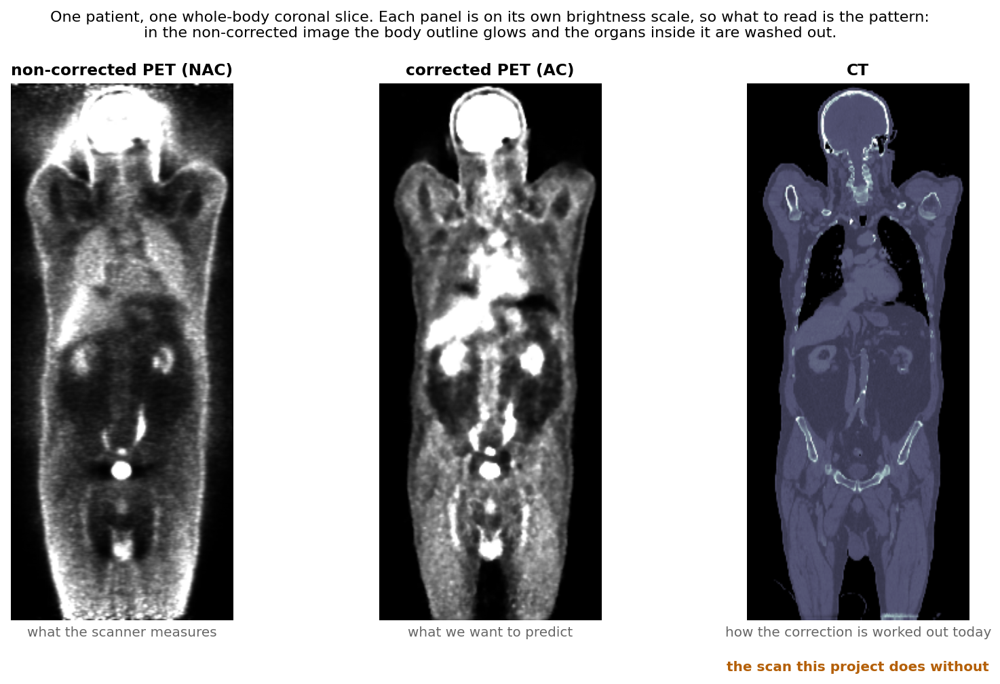
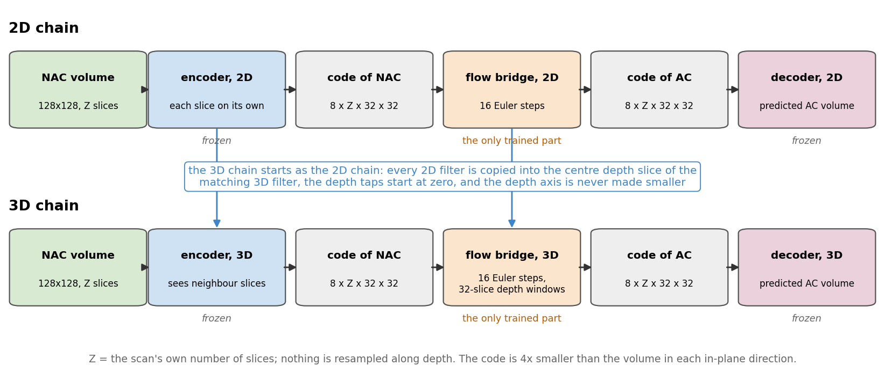
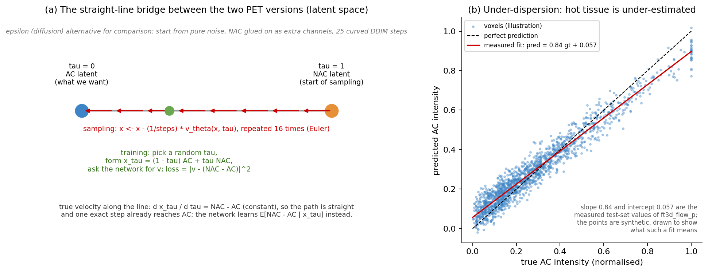
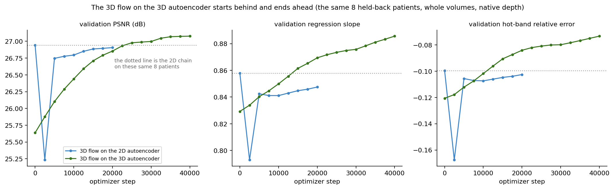
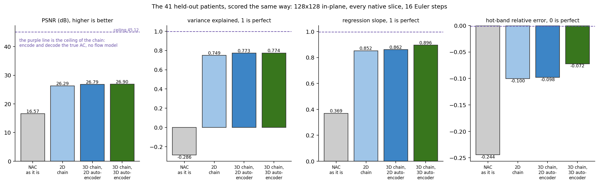
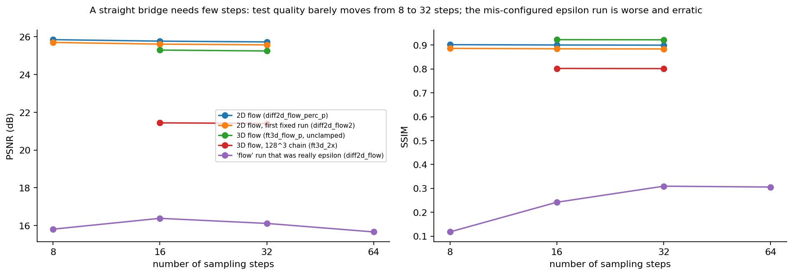

# Predicting corrected PET from non-corrected PET, without a CT scan

**Project report — the main experiment, the numbers it is judged by, and how the
alternatives compare**

| | |
| --- | --- |
| Author | Eliyahu Dagi |
| Repository | `PetCt`, branch `dev` |
| Report date | 2026-09-10 |
| Best model | `outputs/ft3d_slab_flow_ae3d_cont/last.pt` on `outputs/ae3d_slab/best.pt` |
| See the output | **[nac_to_ac_viewer.html](nac_to_ac_viewer.html)** — six held-out patients, every slice, input / prediction / truth side by side. One self-contained file; open it by double-clicking. |

---

## 1. The problem

A PET scan measures where a radioactive tracer sits in the body. The raw measurement is
wrong in a known way: the deeper a signal starts, the more of it is absorbed on the way
out, so deep organs look dimmer than they are. The standard fix uses a CT scan to work out
how much each ray was absorbed. That gives the **corrected** image (short: **AC**, for
attenuation-corrected); the raw one is the **non-corrected** image (short: **NAC**). The CT
scan costs the patient extra radiation, and some scanners have no CT at all. So: can the
corrected image be predicted from the non-corrected image alone?



---

## 2. The main experiment

One model, trained one way, measured on 41 patients it never saw:

```
NAC -> encoder 3D -> flow bridge 3D -> decoder 3D -> AC
```



It does three things.

1. **Encode.** An autoencoder squeezes the volume 4x in each in-plane direction into a
   small code: 8 channels, one code slice per image slice, 32x32 each. It is trained
   beforehand to rebuild PET images, and is then **frozen**. Working in the code instead of
   the volume is what makes 3D affordable — the network sees a grid 16x smaller in area
   than the image.
2. **Move the code.** A network is trained to carry the code of the non-corrected image
   over to the code of the corrected image. **This is the only part trained here.**
3. **Decode.** The frozen decoder turns the moved code back into a volume.

### How the code is moved



Draw a straight line between the two codes and let a dial `t` run from 1 (non-corrected) to
0 (corrected):

```
code(t) = (1 - t) * code_AC + t * code_NAC        the point on the line
velocity = code_NAC - code_AC                     the direction to travel, constant
```

The network is shown a point on the line and the dial value, and is trained to predict the
velocity there. At test time it starts at the non-corrected code and walks backwards along
its own predicted velocity in 16 equal steps. Three consequences, all checked rather than
assumed:

- **The step count barely matters.** The line is straight, so the velocity along a path is
  the same everywhere, and coarse steps agree with fine ones. Measured in §7, experiment 5.
- **This is regression, not sampling.** With squared error the best possible answer is the
  *average* corrected image given the non-corrected one, and averaging pulls values toward
  the middle. That is a property of the objective, not a bug — but it is *not* what the low
  slope in the tables is measuring; see §4.
- **The non-corrected image must not be fed in a second time** as a side input. If it is,
  the network reads the answer straight off the line
  (`code_AC = code(t) - t * velocity`) and learns nothing useful.

### The three design decisions that make it work

**Everything happens in the code, not the volume.** The flow network runs 16 times per
scan, once per step along the bridge; the encoder and decoder run once each. So the part
that runs often should be the cheap part. In the code the network sees 32x32 positions per
slice instead of 128x128 — 16 times fewer places to compute at — and that is what lets a
32-slice window of a real scan fit on one 24 GB card and keeps a training step at 0.62 s.
The same network on full-resolution 3D volumes does not fit at these depths at all. The
price is that the code's own rebuilding error is baked into every answer, so that ceiling
is measured rather than assumed: 45.1 dB against the model's 26.9 (§4). It is nowhere near
being what limits this.

**The depth axis is never squeezed.** Volumes are resized to 128x128 in-plane and **every
native slice is kept**; the autoencoder and the flow network downsample in-plane only. So
the code has exactly as many slices as the image. That lets the model train on short stacks
of 16 slices and then run over a whole scan in overlapping 32-slice windows, blended with a
triangular weight. An earlier version squeezed whole volumes into a 64x64x64 box, which
threw away real resolution; none of its numbers are comparable with anything here.

**The 3D model starts life as the working 2D model.** The reason is the amount of data. The
same training set is 287 volumes in 3D but **85525 slices in 2D** — about 300 times more
examples of the same patients. A 3D network started from nothing has to learn what a PET
image even looks like from 287 examples; a 2D network learns that from 85525. So every
stage here is trained flat first, run until it stops improving, and only then given depth —
which leaves the few 3D examples to teach the one thing 2D cannot, how neighbouring slices
relate.

The handover is exact. Every trained 2D filter is copied into the **centre depth slice** of the matching 3D filter, and the depth taps start at
zero. A 3D filter that is zero everywhere except its middle slice does exactly what the 2D
filter did. So at step 0 the 3D chain *is* the 2D chain applied slice by slice — checked
numerically, not assumed: 3D at step 0 scores **26.28526 dB**, the 2D chain **26.28526 dB**,
on all 41 test patients. (That only worked after fixing the copy to take the *averaged* 2D
weights; copying the raw weights cost 0.08 dB.) Training can then only add depth
information, and every later measurement is a clean before-and-after against a real,
working starting point.

### How it was trained, run and scored

| | |
| --- | --- |
| trained | random 16-slice stacks, batch 2, gradients accumulated 4x, learning rate 5e-5 with a 500-step ramp, 40000 steps |
| run | 32-slice windows, stride 16, triangular blend, 16 steps along the bridge, output clamped to the valid range |
| scored on | 10 public and in-house collections with paired volumes; one fixed by-patient split reused from file, so every arm sees the same **41 test patients** and the same 8 validation patients. Test patients are used for nothing else. |

Comparisons are **paired**: every table gives the per-patient win/loss count and a paired t
value, because patients differ far more than the arms do. Read a t of 2 or more as
significant at 41 patients. The t is always computed on *distance from the ideal value*,
never on the raw difference, and quoted positive when the second arm is better — which
matters for the error metrics, since a patient whose hot band moves from −1% to +4% has got
worse, and only the distance form counts it that way.

---

## 3. The four numbers, and how each one is computed

Every metric is computed per patient over the whole volume, then averaged over the 41
patients. Intensities live in [0, 1]: each volume is divided by its own 99th percentile and
clipped, so 1.0 means "this patient's bright level". Two of the four numbers are about
**likeness** — does the picture look right — and two are about **intensity** — are the
numbers in it right. The intensity pair is what a clinical reading would turn on.

**1. Peak signal-to-noise ratio, in decibels.** Average the squared difference over every
voxel in the box, then take ten times the base-ten logarithm of `1 / that average`. Every
voxel counts the same and most of the box is air, which is easy — so the absolute value is
flattering, and only *differences between arms* carry information. Three decibels means the
average squared error was halved.

**2. Structural similarity, 0 to 1.** Slide a small window (7 voxels across, weighted by a
Gaussian, in all three directions) through the volume. In each window compare the local
average, the local spread, and how much the two images vary together; multiply those into
one local score, and average over every window. It answers "does the local texture match",
so it reacts to blur and smeared edges far more strongly than the signal-to-noise ratio.

**3. Regression slope — the important one.** Take every voxel where the truth has real
signal (the rule is *true value above 5% of that patient's brightest value*, which removes
air) and fit a straight line predicting the model's value from the true value:

```
prediction  ~=  slope * truth + intercept
```

Slope 1.0 with intercept 0 means the prediction reproduces the full range of intensities.
Below 1.0 means it is compressed toward the middle: bright things not bright enough, dim
things not dim enough. This is the clinically interesting number, because a PET scan is
read for how bright a spot is *relative to its surroundings*, and a squashed range is
exactly the failure that hides a lesion.

It is worth knowing that the slope is a **product of two different things**:

```
slope  =  correlation  x  (spread of prediction / spread of truth)
```

The first factor is whether the two images agree about *where* the uptake is. The second is
merely how wide the prediction's range is. They mean opposite things, and §4 measures which
one is actually low here — the answer redirects the whole project.

**4. Hot-band relative error.** Inside the same foreground, rank the true values and take
the band between the **90th and the 98th percentile** — the brightest tissue, which is
where a tumour lives. Average the truth over those voxels, average the prediction over the
same voxels, and report the difference as a fraction of the true average. So −7.2% means
the model reads 7.2% low in exactly the tissue that matters most. The band stops at the
98th percentile on purpose: normalisation clips at the 99th, so the top few percent of
every true volume is pinned at exactly 1.0 and any metric reaching into it reads zero by
construction. **This is also what cannot be measured here** — peak lesion intensity is
discarded by that clip, and recovering it needs a different normalisation, not a better
metric.

Two supporting numbers appear in the tables: **variance explained**, which is
`1 − sum((truth − prediction)²) / sum((truth − average truth)²)` over the same foreground
with nothing refitted, so it punishes a wrong range and a wrong pattern together (zero
means no better than predicting the average everywhere, negative is worse than that); and
**p95 relative error**, the hot band's idea at a single point — the 95th percentile of the
prediction against the 95th percentile of the truth.

---

## 4. What the main experiment scores

41 held-out patients, mean over patients.

| | PSNR (dB) | SSIM | variance explained | slope | hot band | p95 |
| --- | --- | --- | --- | --- | --- | --- |
| The non-corrected input, as it is | 16.571 | 0.4466 | −0.286 | 0.369 | −24.4% | −0.8% |
| **The main experiment** | **26.896** | **0.9343** | **0.774** | **0.896** | **−7.2%** | **−2.2%** |
| *Ceiling: encode and decode the true corrected image* | *45.117* | *0.9974* | *0.996* | *0.997* | *−0.1%* | *−0.2%* |

Read it like this.

- **The chain does the job.** From a 16.6 dB input it produces a 26.9 dB prediction, and
  turns a *negative* variance explained — the non-corrected image is worse than predicting
  the average everywhere — into 0.77. The hot band goes from reading 24% low to 7% low.
- **The frozen coder is not the limit.** Its round trip is 45.1 dB with slope 0.997 and a
  −0.1% hot band, so whatever is missing above is the flow bridge's doing, not the coder's.
- **What is left has a name, and it is not the one we assumed.** Split the slope into its
  two factors (§3), measured over exactly the voxels the slope is measured on: the spread
  ratio is **1.0005** and the correlation is **0.8961**. The prediction is **not
  squashed** — its range already matches the truth's to within a twentieth of a percent.
  The whole "10% too flat" is the two images disagreeing about *where* the uptake sits.

Three things follow from that last point.

1. **No rescaling can help.** The best single multiplier for all patients is 1.006, worth
   +0.004 of slope. Stretching each prediction until the slope reads exactly 1.0 costs
   0.43 dB and 0.028 of variance explained, and flips p95 from reading 2.2% low to 0.4%
   high — it starts inventing uptake. Multiplying a partly-wrong pattern amplifies the
   error along with the signal.
2. **Squared error is not the culprit.** Its own optimum would be a spread ratio equal to
   the correlation, 0.896 — *more* flattening than the model actually does, and only 1 of
   41 patients sits there. The model is not under-trained on range; it is already past
   where squared error would put it.
3. **A loss that rewards the slope can cheat.** With the spread ratio already at 1.0, the
   cheapest way to raise a slope score is to make the prediction wider and brighter, and
   two arms have now done exactly that (§7, experiments 6 and 7). The correlation cannot be
   cheated the same way: it does not change when a prediction is multiplied or shifted, so
   the only way to raise it is to move predicted uptake to where the true uptake is.

Measured with `scripts/_diag_corr_ceiling.py`.

---

## 5. How the run behaved



On the 8 fixed validation patients the run went 25.638 dB / slope 0.829 / hot band −12.1%
at step 0, to 26.855 / 0.869 / −8.4% at step 20000, to **27.077 / 0.886 / −7.3%** at step
40000. Three things came out of watching it.

**It needed all 40000 steps.** Step 0 sits 1.3 dB *behind* the arm built on the older 2D
coder, because it starts on different codes, and it spent its first 20000 steps climbing
back. Judged at the halfway snapshot it looks like a trade rather than a win, which is how
the ranking gets inverted (§7, experiment 4).

**A warm start needs a gentle first step.** Every run here ramps the learning rate over its
first 500 steps. On the autoencoder, starting from an exact copy *without* that ramp let
the very first optimizer update — a full-size step on every weight, including the zero
depth taps — wreck the copy outright: validation loss 0.0030 → 0.0151 after one update. The
dip near step 2500 in the curve is the milder version of the same thing.

**Both halves of the curve have levelled off, and the one that still looks alive is an
illusion.** Over the last 5000 steps sharpness stopped moving (0.009 dB on validation)
while slope and hot band kept climbing in a straight line, which reads as "calibration is
still improving" and is wrong. Given 6000 further plain steps the *correlation* moves by
+0.0001 with a t of 0.4, nothing at all, while the prediction's range keeps inflating and
the slope metric rewards it (§7, experiment 7).

One more thing these curves show: 8 validation volumes cannot rank arms. One arm looks flat
on them and still wins **41 of 41** test patients (§7, experiment 1). Validation is for
watching a run; the paired test comparison is the judgement.

---

## 6. Looking at the output

The numbers cannot show what the prediction looks like, so the pictures are a separate
deliverable rather than a figure here:

> **[nac_to_ac_viewer.html](nac_to_ac_viewer.html)** — one self-contained file, about
> 23 MB, no server and no network needed. It carries the **full predicted volumes** for
> six held-out patients and shows the non-corrected input, the prediction, the truth and
> their difference. Every slice is browsable — scrub through them, play them as a loop, or
> see the whole scan at once as a contact sheet — in all three planes.

Three of the six are picked by rank, so the file cannot flatter the model: the **best**
(`AMC-026`, 31.1 dB, slope 0.946, hot band −4.5%), a **typical** one (`31128984`, 27.0 dB,
the median of the 41, slope 0.846, hot band −10.1%), and the **worst** (an ACRIN 6668
patient, 20.4 dB, slope 0.637, hot band −32.0%, variance explained 0.02). Looking at the
worst one is the fastest way to understand what the averages hide.

The other three are ordinary cases at three different cancer sites, so the method can be
seen away from any one part of the body: **lung** (`AMC-018`, 26.3 dB, slope 0.948, hot
band −1.6%), **bladder** (`31485548`, 28.0 dB, slope 0.916, hot band −6.4%) and **uterine**
(`C3L-00962`, 27.5 dB, slope 0.954, hot band −5.2%). All three sit within about a decibel
of the 26.9 dB test mean, and they come from three separate collections.

What to look for: the input's bright body-surface rim and dim interior, both gone in the
prediction; liver, heart, kidneys and bladder restored to roughly the right brightness; and
the brightest small spots still a little too smooth and too dim, which is the −7.2% hot
band made visible.

The volumes in that file are the exact arrays this report's numbers were computed from. The
non-corrected input is not saved by the scorer, so it is rebuilt by the same call the
scorer uses, and the rebuilt truth is then checked against the scorer's own dumped truth
voxel for voxel before packing (`scripts/make_viewer_data.py`, then
`scripts/make_viewer_html.py`). Display values are quantised to 256 levels; no number in
this report comes from that file.

---

## 7. Comparing the experiments



Every arm below is scored by the same script, on the same grid, on the same 41 test
patients. Best value per column in bold; the input and the ceiling are in §4. Each arm
appears once, at the end of its training; the halfway reading of the main experiment is
not another arm, and it is in experiment 4.

| | PSNR (dB) | SSIM | variance explained | slope | hot band | p95 |
| --- | --- | --- | --- | --- | --- | --- |
| 2D chain | 26.285 | 0.9243 | 0.749 | 0.852 | −10.0% | −5.8% |
| 3D flow bridge, 2D autoencoder | 26.786 | 0.9307 | 0.773 | 0.862 | −9.8% | −5.9% |
| **The main experiment** (3D flow bridge, 3D autoencoder) | **26.896** | **0.9343** | **0.774** | **0.896** | **−7.2%** | **−2.2%** |

Each experiment below is a **single change against a matched control**.

**1. Depth in the flow bridge.** 2D chain → 3D flow bridge, same frozen 2D autoencoder.
The clean test of "does depth help", because the starting point *is* the 2D chain. It gains
+0.501 dB (t +10.8, **41 of 41 patients**), +0.0063 structural similarity (**41/41**) and
+0.024 variance explained (40/41), but only +0.009 slope (t +5.2, 32/41) and no real
movement in the hot band (t +1.7). Depth information helps every single patient — and it
buys sharpness, not calibration.

**2. A 3D autoencoder instead of a 2D one.** Judged on the round trip alone — encode the
true corrected image, decode it, compare — so the flow bridge plays no part. The round trip
goes from 41.958 dB / slope 0.9626 / hot band −2.7% / p95 −3.5% to **45.117 / 0.9971 /
−0.1% / −0.2%**: **+3.159 dB and 41 of 41 patients on every one of those metrics**. The
non-corrected round trip moves the same way, 40.754 → 44.402 dB, 41/0. This is what removes
the coder as a suspect for anything else.

**3. The end-to-end claim: the main experiment against the 2D chain.** +0.611 dB (t +8.0,
35/41), structural similarity +0.0099 (**41/41**), mean absolute error 0.0150 → 0.0138
(38/41), variance explained +0.025 (35/41), slope 0.852 → 0.896 (t +16.4, **40/41**), hot
band −10.0% → −7.2% (t +18.5, **41/41**), p95 −5.8% → −2.2% (t +10.1, 38/41). Relative bias
is the only metric that does not move (−0.8% → −0.9%, 21/41): the average intensity was
already right in the 2D chain, and what improves is the spread around it.

**4. The same run, 20000 steps longer.** Not a design change, but the experiment that
decided the ranking. Against the 3D-flow-on-2D-coder arm, the 3D-coder arm loses on
sharpness at 20000 steps (−0.149 dB, better on only 10 of 41) while winning slope 0.862 →
0.884 (39/41) and hot band −9.8% → −8.1% (40/41). After another 20000 steps it wins both:
+0.110 dB (t +2.2, 32/41), SSIM +0.0036 (39/41), slope +0.034 (**40/41**), hot band
+2.6 points (**41/41**), p95 +3.7 points (39/41). So "the 3D coder trades sharpness for
calibration" was a statement about training time, not about the coder.

**5. The step count barely matters.** Going from 8 to 32 steps along the bridge — a
four-fold change — moves the signal-to-noise ratio by at most 0.13 dB, and slightly
*downwards*: 25.846 / 25.767 / 25.725 for the 2D flow arm. That is the signature of a
straight-line bridge with no curvature for the extra steps to correct, and it is why
inference is cheap. (Measured on the earlier arms; 16 steps were then fixed for everything
above, as the conservative choice.) A run that is *not* flat here is not the model its
label claims: the one mislabelled run in the project swings 15.8 → 16.4 → 16.1 dB.



**6. Weighting the error by the true uptake — the attempt at the flatness.** Both arms run
6000 steps at 5e-5 from the finished step-40000 model, in lockstep on the same patients,
crops and sampled dial values; the only difference is that one arm multiplies the velocity
error at each code position by the true uptake there. The idea was that bright tissue is
where the flatness hurts, so bright tissue should count for more. Scored 2026-09-10.

| | matched control | uptake-weighted | paired |
| --- | --- | --- | --- |
| PSNR (dB) | 26.891 | 26.917 | +0.026, no real change |
| SSIM | 0.9343 | 0.9340 | −0.0003, t 2.2, **worse** (13/41) |
| variance explained | 0.7741 | 0.7754 | +0.0013, no real change |
| slope | 0.8976 | 0.9014 | +0.0038, t 6.8, 35/41 |
| intercept | 0.0359 | 0.0381 | +0.0022, t 6.0, **worse** (7/41) |
| hot band | −7.10% | −6.58% | +0.51 points, t 8.6, **39/41** |
| p95 | −2.14% | −1.91% | +0.23 points, t 3.8, 27/41 |
| invented uptake (pooled) | 0.458% | 0.507% | **worse on 38 of 41** |

**It does not work, and the reason is worth more than the result.** Split the slope gain
into its two factors (§3): the correlation rose by +0.0008 (t 2.2, better on only 24 of 41)
while the spread rose by +0.0033 (t 7.6, 34 of 41). **Four fifths of the headline gain is
the prediction simply getting brighter and wider, not more correct.** The rest of the score
sheet agrees — the intercept rose, structural similarity slipped, the average bias went
from reading 0.9% low to 0.2% high, and the average intensity of *cold* body tissue went
from 13% too bright to 15% too bright. The invented-uptake check names the cost directly:
the arm calls more cold tissue hot on 38 of 41 patients, buying a 0.06-point cut in missed
hot tissue with a 0.05-point rise in uptake that is not there. In this domain that is the
wrong side of the trade.

**7. What 6000 steps of plain training actually buy.** The control from experiment 6 is an
experiment in its own right, and it overturns the reading of the training curves. Against
the step-40000 model it gains slope +0.0017 (t 3.3, 29/41) and hot band +0.13 points
(t 4.4, 33/41), with sharpness, structural similarity and variance explained all unmoved.
But split the slope gain and **95% of it is spread: the correlation moved by +0.0001 with a
t of 0.4, which is to say not at all.** Agreement between the prediction and the truth has
plateaued. What is still creeping is the prediction's range, which the slope metric rewards
and which is worth nothing.

---

## 8. What is not claimed

- **Nothing clinical.** Intensity agreement on normalised volumes only: no per-organ uptake
  bias, no lesion detection, no reader study, and peak lesion intensity is unmeasurable
  under this normalisation (§3).
- **The four metrics cannot see invented uptake.** They only score places where the truth
  already has signal. Measured separately with `scripts/_diag_false_hot.py`: 0.45% of truly
  cold body voxels are called hot (3.15% on the worst patient), and cold tissue overall
  runs about 13% too bright. Any change that pushes predicted values up risks this first.
- **Two data caveats.** About 5% of the paired patients are mismatched pairs; none are in
  the test set. And the frozen 2D autoencoder was trained before the split was frozen, so
  it has seen 35 of the 41 test patients — equally for every arm, so the comparisons hold,
  but read the absolute decibels as slightly optimistic.
- **Converged on sharpness, stalled on agreement.** More of the same training will not lift
  the 0.896 slope (§7, experiment 7).

---

## 9. Cost and reproducing it

| | |
| --- | --- |
| 3D autoencoder | 35.7M parameters, 20000 steps |
| flow network, each arm | 29.0M parameters, ~0.62 s/step; 20000 steps ≈ 3.5 h, and the main experiment ran 40000 |
| hardware | one 24 GB GPU for everything |

```bash
# the 3D autoencoder, warm-started from the 2D one
bash scripts/_ae3d_slab.sh

# the 3D flow bridge on it (RESUME=1 to continue; INIT_FROM=<ckpt> to branch a new run)
bash scripts/_slab_flow_ae3d.sh

# score the 41 test patients and print the paired comparison
WHICH=both bash scripts/_slab_flow_eval.sh

# the figures in this report (the first line runs in WSL: it reads DICOM, and CT at that)
PYTHONPATH=. python scripts/_extract_problem_slices.py
python scripts/make_scheme_figures.py

# the standalone viewer (needs a scored dump; packs, then folds into one html)
python scripts/make_viewer_data.py && python scripts/make_viewer_html.py
```

Configs: [ae3d_slab.yaml](../src/training/configs/ae3d_slab.yaml),
[ft3d_slab_flow.yaml](../src/training/configs/ft3d_slab_flow.yaml),
[ft3d_slab_flow_ae3d.yaml](../src/training/configs/ft3d_slab_flow_ae3d.yaml).
Long jobs must be launched detached (`setsid nohup ...`) or they die with the terminal, and
the fast data cache is `/root/petct_cache`, not the Windows drive.

---

## 10. Where to go next

**1. A loss on agreement, not on scale.** The slope is a product, its spread half is
already right, and every route tried so far moves only that half. The correlation cannot be
gamed that way — multiplying or shifting the prediction leaves it unchanged — so the arm to
run is a `1 - correlation` penalty against the reused control of experiment 6, its weight
picked from a gradient-size probe, judged on the change in correlation with the spread
ratio printed beside it. **The likely answer is that it will not move.** Agreement may be
bounded by what the non-corrected image alone determines, and that bound is a result worth
reporting rather than tuning around.

**2. The matched 40000-step control for the 2D-autoencoder arm** — experiment 4 still
compares it at 20000.

**3. Something clinical.** Per-organ uptake bias against segmentation masks, and a
normalisation that does not clip the peak, so lesion intensity becomes measurable at all.

---

## 11. The data, and how it was split

Ten folders of PET/CT studies: eight public collections from the Cancer Imaging Archive,
plus two local sets that did not come from it (`Bladder 13.11.25` and `PET_CT_NORMAL_2`).
Patients are counted, never scans. A patient is one folder, and each one falls in exactly
one of train, validation or test.

The two stages need different things from a patient, so there are two pools. The
autoencoder only has to compress a PET volume, so any usable volume counts, corrected or
not. The flow bridge has to be shown a non-corrected volume **and** its corrected twin from
the same patient, and that is a smaller set.

| | patients | train | validation | test |
| --- | --- | --- | --- | --- |
| Any usable PET volume — the autoencoder | 628 | 439 | 126 | 63 |
| A matched non-corrected + corrected pair — the flow bridge, and every number in this report | 410 | 287 | 82 | 41 |

Where they come from. The second column counts patients with a matched pair; the third is
the larger autoencoder pool, shown only where it differs.

| collection | paired | any volume |
| --- | --- | --- |
| ACRIN 6668 | 194 | 345 |
| NSCLC_Radiogenomics | 112 | 128 |
| Bladder 13.11.25 (local) | 66 | |
| TCGA-LUAD | 18 | |
| CPTAC-LUAD | 8 | 9 |
| CPTAC-LSCC | 6 | |
| CPTAC-UCEC | 3 | |
| CPTAC-PDA | 2 | |
| TCGA-THCA | 1 | |
| PET_CT_NORMAL_2 (local) | 0 | 50 |

Three things about the split.

**It is 70/20/10 by patient, drawn once with seed 42, then written to a file.** Every run
since reads that file (`--split_json`) rather than drawing its own. Drawing it again is not
reproducible even from the same seed, so without the file two arms would end up scored on
different patients and could not be compared.

**Validation picks the checkpoint. The 41 test patients are used once, at the end.** They
are the 41 behind every number in §4 and §7, and behind the viewer.

**Read §8 before quoting the absolute decibels.** The frozen 2D autoencoder predates the
split file and has seen 35 of the 41 test patients, and about 5% of the paired patients are
mismatched pairs — none of them in the test set.
