# Predicting attenuation-corrected PET from non-corrected PET without a CT scan

**Project report**

| | |
| --- | --- |
| Author | Eliyahu Dagi |
| Repository | `PetCt` (branch `dev`, 40 commits, 2026-01-04 to 2026-09-02) |
| Report date | 2026-09-02 |
| Main deliverable | A trained 3D model (`outputs/ft3d_flow_p/best.pt` + `outputs/ae3d_p/best.pt`) that turns a non-corrected PET volume into a predicted attenuation-corrected PET volume, plus the code, data tooling, evaluation, two graphical tools and this report |

This report is written for a senior engineer who is not from medical imaging or from generative modelling. Every abbreviation is spelled out the first time it is used, and a glossary is given in Appendix A. The words are kept plain; the content is not simplified.

---

## Table of contents

1. Summary
2. Background: what the problem is and why it is hard
3. Deliverables
4. Data
5. Method
6. Experiments and results
7. The code: layout, contracts, status, known bugs
8. How to replicate every result
9. Limitations, open problems and possible extensions
10. Position against the published literature
11. References
- Appendix A: glossary
- Appendix B: raw result tables
- Appendix C: list of figures

---

## 1. Summary

**What the project does.** PET (Positron Emission Tomography) is a scan that shows where a radioactive tracer collects in the body. The raw PET picture is distorted because the body absorbs part of the radiation before it reaches the detector. Clinically this is fixed with a CT (Computed Tomography, an X-ray density scan) taken in the same session; the CT tells the scanner how much each part of the body absorbs. The corrected picture is called **attenuation-corrected PET (AC PET)**; the raw one is **non-attenuation-corrected PET (NAC PET)**. This project trains a neural network to predict the AC PET volume directly from the NAC PET volume, so that no CT is needed for the correction. That would remove one X-ray dose and open the door to PET-only devices.

**How.** The model is a four-stage chain (Figure 2). Two autoencoders learn a compact 3D code for PET volumes. A generative model then learns to move from the code of a NAC volume to the code of the matching AC volume. The generative model is a *rectified-flow bridge*: it learns a straight-line displacement from the NAC code to the AC code and replays it in a few deterministic steps. A conventional noise-based diffusion model was tried first and collapsed (Section 6.4); the flow bridge was the fix. The 2D versions of both networks are trained first on slices and then "inflated" into 3D networks, which are fine-tuned on whole volumes.

**Result.** On 41 held-out patients that the model never saw, the best model (`ft3d_flow_p`) reaches a structural similarity of 0.923 and a peak signal-to-noise ratio of 25.45 dB against the true AC volume, up from 0.43 and 16.66 dB for the uncorrected input. Regression of predicted against true intensity gives a slope of 0.84, meaning the model still under-estimates the brightest tissue by roughly 10 percent (the "hot band" error is −10.0 percent). Section 5.3.6 proves that this under-estimation is the expected behaviour of any model trained with a squared-error loss on an under-determined problem, and Section 6 measures every attempt made to reduce it. One of those attempts, weighting the loss by the true tracer uptake, produced a small but very consistent improvement (38 of 41 patients improved on slope, 39 of 41 on hot-band error) at no cost elsewhere.

**What did not work, measured honestly.** Noise-based diffusion (both 2D and 3D) failed to use the input and produced structureless output. A perceptual-loss variant recommended in the rectified-flow literature made results significantly worse. A doubled-resolution chain (128³ voxels instead of 64³) was substantially worse within the training budget it was given. Short fine-tuning experiments at a small learning rate moved nothing, which taught us that fine-tuning ablations need a longer budget and a matched control.

**Status.** The code runs end to end, is covered by 306 unit tests, and has two graphical tools: a desktop viewer for the raw scans and a web tool that launches training and shows predictions. The known bugs and the stale parts of the documentation are listed in Section 7.6. All the numbers in this report can be regenerated with the commands in Section 8.

---

## 2. Background: what the problem is and why it is hard

### 2.1 What a PET scan measures

A PET scan starts with an injection of a sugar molecule carrying a radioactive atom (most often fluorodeoxyglucose, written FDG). Cells that burn a lot of sugar, such as tumours, brain and heart muscle, take up more of it. The radioactive atom decays and emits a positron, which meets an electron within a millimetre or two and turns into two photons (gamma rays) that fly off in opposite directions. A ring of detectors around the patient catches pairs of photons that arrive at the same time. Each pair defines a line through the body along which the decay happened. From millions of such lines a computer reconstructs a 3D map of where the tracer is.

The map is reported as a value per voxel (a voxel is a 3D pixel). In clinical use the value is normalised by the injected dose and the patient's weight to give the **Standardised Uptake Value (SUV)**, so that scans of different people can be compared. Radiologists read the maximum SUV of a lesion to judge how active it is and to track treatment. This matters for this project: a good prediction must get the *brightness* right, not just the shape.

### 2.2 Attenuation and why a CT is used

A photon that has to cross 30 centimetres of tissue has a high chance of being absorbed or scattered before it reaches the detector. Deep parts of the body therefore look dimmer than they should, and the body's edge looks brighter than it should (a "halo"). The physical name for this loss is **attenuation**. Correcting for it requires knowing how much each point in the body absorbs radiation, which is exactly what a CT scan measures. Every modern PET scanner is a PET/CT: the CT is taken first, converted into an attenuation map, and the map is used inside the PET reconstruction. The result is the AC PET image that clinicians read.

The CT costs extra radiation dose, adds hardware, and can be mis-aligned with the PET because the patient breathes between the two scans. Removing the CT from the loop has been an active research target for about six years (Section 10).

### 2.3 The task in one sentence

Given the NAC PET volume of a patient, predict the AC PET volume that the scanner would have produced with the CT-based correction.

### 2.4 Why it is hard

1. **The needed information is not in the input.** The absorption map lives in the CT. The NAC image only shows it indirectly: the way the tracer distribution is dimmed and haloed hints at the body shape and density. The model has to learn typical human anatomy as a prior and infer the correction from those hints. Two patients with the same NAC image could in principle need different corrections. The problem is therefore under-determined, and Section 5.3.6 shows the exact consequence of that for any model trained with a squared-error loss.
2. **Brightness matters, not just looks.** A picture that looks right but is 15 percent too dim in the hottest tissue would mislead a radiologist reading the maximum uptake of a lesion. So the metrics have to include calibration measures (regression slope, relative error in the hottest band), not only picture-quality scores.
3. **Volumes are large and 3D.** A whole-body PET volume is a few hundred slices of 128×128 to 200×200 voxels. A 3D network on the full volume does not fit in the memory of one graphics card. This project works on a compressed code ("latent") of the volume, and on a down-sampled 64³ cube, which itself costs accuracy (Section 6.6).
4. **Paired data is scarce.** Training needs the NAC and AC version of the same scan. Most public collections only store the AC image. Of 628 patients on disk, only 410 had both versions (Section 4).

---

## 3. Deliverables

All paths are relative to the repository root.

| Deliverable | Where | Notes |
| --- | --- | --- |
| Training pipeline (four stages, launcher, data loading, caching, evaluation, inference) | `src/training/` | Python, PyTorch, MONAI (Medical Open Network for AI, a medical-imaging library built on PyTorch). Runs on Linux (here: Windows Subsystem for Linux, WSL) with one graphics card |
| Trained models, best run | `outputs/ae3d_p/best.pt` (3D autoencoder, 427 MB, 35.7 M parameters), `outputs/ft3d_flow_p/best.pt` (3D flow model, 462 MB, 29.0 M parameters) | Each checkpoint embeds its own configuration, so inference can rebuild the network without the YAML configuration file (YAML is a plain-text configuration format) |
| Trained models, supporting stages | `outputs/ae2d_p/best.pt` (147 MB), `outputs/diff2d_flow_perc_p/best.pt` (176 MB) | The 2D stages that the 3D models were inflated from |
| Trained models, other arms | `outputs/ft3d_ft_iwlat`, `outputs/ft3d_ft_ctl5e5`, `outputs/ft3d_flow_lpl_rfpp`, `outputs/ft3d_2x`, `outputs/ae3d_2x2`, `outputs/diff2d`, `outputs/diff2d_cfg`, `outputs/ft3d`, and 12 fine-tune ablation arms | See Section 6 |
| Evaluation results (raw per-patient numbers and summaries) | `outputs/eval/<run>/*.json` | 14 metrics per patient, plus summary means |
| Training logs | `outputs/<run>/metrics.jsonl` and `outputs/<run>/runs/<run_id>/` | One JSON row per logged step, phase = train or val |
| Data-preparation tooling | `src/training/precache.py`, `scripts/inspect_pet_nac.py`, `scripts/download_tcia_*.py` | Turns DICOM (Digital Imaging and Communications in Medicine, the scanner file format) folders into a fast float16 cache |
| Web tool to launch training, watch metrics, view predictions | `src/TrainViewer/` | Gradio. Runs on Windows without PyTorch; talks to the training process only through files |
| Desktop viewer of CT, AC PET, NAC PET with overlays | `src/DataViewer/` | Tkinter. Also hosts the prostate locator and the "zone of interest" box from the earlier phase of the project |
| Core geometry and segmentation helpers | `src/utils/` | `VolumeGeometry` voxel-to-millimetre mapping, prostate locator, segmentation wrappers |
| Unit tests | `src/tests/` (29 files, 306 test functions) | `pytest src/tests/` |
| Experiment drivers and diagnostics | `scripts/_*.sh`, `scripts/_diag_*.py` | Every experiment in Section 6 has a driver script |
| Figures for this report and the script that draws them from the raw outputs | `docs/figures/fig01…fig19.png`, `scripts/make_report_figures.py` | The script recomputes every number from the JSON files |
| Implementation references | `docs/flow_matching_reference.md`, `docs/nac_ac_benchmark.md` | Flow-bridge derivation notes; literature benchmark table |
| This report | `docs/PROJECT_REPORT.md` | |

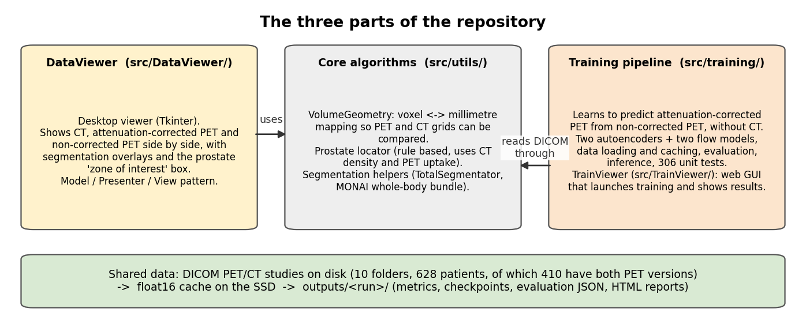

*Figure 1. The three parts of the repository and the data they share. The viewer and the training pipeline are independent programs; both read the same DICOM folders and both use the geometry helpers in `src/utils/`.*

---

## 4. Data

### 4.1 Sources

The scans are stored as DICOM files (Digital Imaging and Communications in Medicine, the standard file format of medical scanners: one file per slice, with a header of tags describing the patient, the scanner settings and the geometry). Ten folders ("roots") are used, all under `/mnt/d/DeepTrainingData/Project/` as seen from WSL:

| Root | Origin | Role |
| --- | --- | --- |
| `ACRIN 6668` | The Cancer Imaging Archive (TCIA), trial ACRIN 6668 of the American College of Radiology Imaging Network: FDG PET/CT of lung-cancer patients | The main source of paired NAC + AC scans |
| `NSCLC_Radiogenomics` | TCIA, non-small-cell lung cancer | Contributes paired scans too |
| `TCGA-LUAD`, `TCGA-THCA` | TCIA, The Cancer Genome Atlas lung and thyroid collections | Mostly AC-only |
| `CPTAC-LUAD`, `CPTAC-LSCC`, `CPTAC-UCEC`, `CPTAC-PDA` | TCIA, Clinical Proteomic Tumor Analysis Consortium collections (lung, uterine, pancreas) | Mostly AC-only |
| `PetCt/Bladder 13.11.25` | A bladder-cancer folder | AC-only |
| `PetCtNormal/PET_CT_NORMAL_2` | A folder of scans read as normal | AC-only |

The TCIA download scripts are `scripts/download_tcia_samples.py` and `scripts/download_tcia_series.py`.

### 4.2 Telling NAC from AC

A patient folder can hold several PET series. The scanner marks the corrected series in the DICOM tag *CorrectedImage* (tag number 0028,0051), which lists the corrections applied; the token `ATTN` means attenuation correction was applied. The loader classifies a series as AC when this tag contains `ATTN` and as NAC otherwise, and only falls back to reading words in the series description when the tag is absent. An earlier version of the loader looked only at the description, which silently dropped the NAC series for about half of the paired patients. This was found and fixed in August 2026 (`scripts/inspect_pet_nac.py` is the audit tool), and all the models in this report were trained after the fix.

### 4.3 Counts

| Set | Patients |
| --- | --- |
| Patients with at least one PET volume (used by the autoencoder stages, which do not need pairs) | 628 |
| Patients with both NAC and AC (used by the generative stages) | 410 |
| AC only | 214 |
| NAC only | 4 |

### 4.4 The float16 cache

Reading one patient's DICOM series from the external disk takes 5 to 8 seconds, which would leave the graphics card idle most of the time. `src/training/precache.py` therefore reads each patient once, normalises the volumes (Section 4.5), and writes them as a compressed NumPy archive in 16-bit floating point with a small JSON sidecar. Details that matter for a maintainer:

- The cache folder defaults to `/mnt/c/DeepTrainingData/PetCT` and can be changed with the environment variable `PETCT_CACHE_DIR` or the `--cache_dir` flag.
- The cache key is the first 32 hexadecimal characters of the SHA-256 hash of the patient folder path.
- The sidecar records a format version (currently 2), the source folder's modification signature (so a changed source folder invalidates the entry), the volume shapes, and which PET versions exist. `sidecar_has_pair` lets the pairing scan skip the DICOM read entirely.
- Writes are atomic (write to a temporary file, then rename), so a killed run cannot leave a half-written entry.
- Only PET is cached; the CT is never loaded by the training pipeline.

All 628 patients are cached. Training with `--cache_dir` set never touches DICOM.

### 4.5 Normalisation and what it costs

Every volume is normalised on its own: the 1st and 99th percentile of its voxel values are mapped to 0 and 1, and values outside are clipped (`normalize_volume` in `src/training/data.py`). NAC and AC are normalised separately, each with its own percentiles.

This is a deliberate simplification with three consequences that recur throughout the report:

1. **Intensities are relative, not SUV.** The dose and weight needed for SUV are not used. All calibration metrics in this report are in normalised units. A per-volume scale factor would have to be recovered to report clinical SUV numbers; that is future work (Section 9).
2. **The top 1 percent is flattened.** Every AC volume has a plateau of voxels at exactly 1.0 (about 1,500 voxels on a 64³ grid, the size of an 11³ block). Any metric that looks at the maximum voxel therefore reads exactly zero error for a prediction that also saturates. The "maximum relative error" metric that the project originally used was retired for this reason; the "hot band" metric (Section 5.8) replaces it.
3. **The mapping is not invertible.** A predicted volume cannot be turned back into scanner units without the two percentiles of the (unknown) true AC volume.

### 4.6 Geometry: what is *not* done

- No resampling to a common voxel size; the pixel spacing and origin stored in the cache are placeholders (1, 1, 1) and (0, 0, 0). NAC and AC of the same scan come from the same reconstruction grid, so no registration between them is needed.
- The 3D stages resize the *whole* volume to a 64³ cube (or 128³ for the doubled-resolution chain) with trilinear interpolation. A whole-body volume of, say, 128×128×300 voxels is squeezed anisotropically. Section 6.6 measures how much accuracy this alone costs (a ceiling of 32.3 dB peak signal-to-noise ratio against the native-resolution truth).
- The 2D stages draw 128×128 slices at random depth positions from three random planes (axial, coronal, sagittal) so that the 2D networks see anatomy from every direction before they are inflated to 3D. Validation of the 2D flow model uses axial slices only.
- Augmentation during training: random flips per axis, random 90-degree rotations in the axial plane, and a mild random affine transform (rotation up to 5 to 7 degrees, scale up to 5 to 10 percent, translation up to 2 percent). The elastic option exists but is off.

### 4.7 Train, validation and test splits

Splits are by patient, so no slice of a test patient is ever seen in training. Seed 42, 20 percent validation, 10 percent test:

| Stage family | Usable patients | Train | Validation | Test |
| --- | --- | --- | --- | --- |
| Autoencoders (any PET) | 628 | 439 | 126 | 63 |
| Generative stages (paired) | 410 | 287 | 82 | 41 |

Every run writes its partition to `outputs/<run>/split.json`. **A pitfall that shaped the experimental protocol:** the same seed and fractions do *not* reproduce the same partition across runs, because the order in which patients are enumerated is not stable. Two runs started independently were found to share only 24 of their 41 test patients, so 17 test patients of one run were training patients of the other. Since then every 3D run is started with `--split_json outputs/ft3d_flow_p/split.json`, so all 3D arms in Section 6 share the same 41 test patients. The one exception is the perceptual arm `ft3d_flow_lpl_rfpp`, which was started before the flag existed; it is compared to the baseline on the 23 test patients the two splits have in common.

---

## 5. Method

### 5.1 The overall design and why

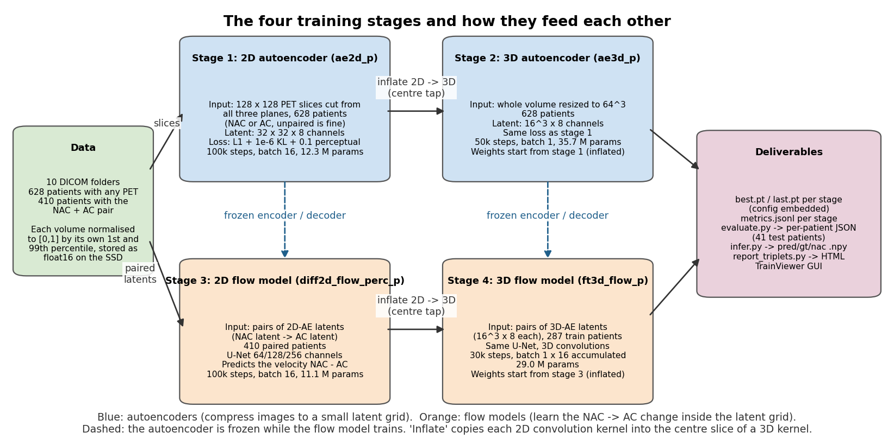

*Figure 2. The four training stages. Solid arrows are data flow; the dashed arrows mark encoders and decoders that are frozen while a later stage trains. Stage 2 and stage 4 start from the weights of stage 1 and stage 3 by "inflation" (Section 5.5).*

The design has three ideas, each answering a resource constraint:

1. **Work on a compressed code, not on voxels ("latent" modelling).** A 64³ volume has 262,144 voxels. The autoencoder compresses it to a 16³ grid with 8 numbers per position (32,768 numbers, an 8-fold reduction), and the generative model works on that grid. This is what makes a 3D generative network fit on one 24 GB graphics card, and it is the standard trick behind latent diffusion models for images.
2. **Learn in 2D first, then inflate to 3D.** Slices are cheap: one volume gives hundreds of them, and a 2D network trains fast. A 2D convolution can be copied exactly into a 3D convolution (Section 5.5), so a 3D network can start as "the 2D network applied slice by slice" and only has to learn how to use the depth direction.
3. **Generate by moving from the input, not from noise.** The generative model is a *rectified-flow bridge* (Section 5.3): it starts from the NAC code and learns the displacement to the AC code. The alternative, a diffusion model that starts from random noise and is told about the NAC through an extra input channel, was tried first and failed to use the NAC at all (Section 6.4).

The four stages, with the names used in the output folders:

| Stage | Folder | Input | Output | Starts from |
| --- | --- | --- | --- | --- |
| 1. 2D autoencoder | `ae2d_p` | 128×128 PET slices (NAC or AC, pooled) | 32×32×8 code | scratch |
| 2. 3D autoencoder | `ae3d_p` | 64³ PET volumes (NAC or AC, pooled) | 16³×8 code | stage 1, inflated |
| 3. 2D flow model | `diff2d_flow_perc_p` | 2D NAC code → 2D AC code | | scratch |
| 4. 3D flow model | `ft3d_flow_p` | 3D NAC code → 3D AC code | | stage 3, inflated |

The suffix `_p` marks the runs trained after the perceptual-loss fix (Section 5.6.1); `flow` marks the flow bridge as opposed to the earlier noise-based diffusion; `ft3d` stands for "fine-tuned 3D" and is the name the 3D generative stage has had since the start of the project.

### 5.2 The autoencoder

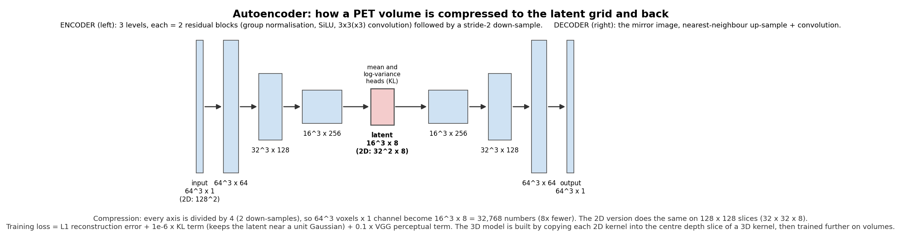

*Figure 3. The 3D autoencoder (2D sizes in brackets). Three resolution levels with 64, 128 and 256 channels, two residual blocks per level, no attention. The encoder outputs a mean and a spread per latent position; the generative stages use the mean.*

**Architecture.** The autoencoder is MONAI's `AutoencoderKL` (MONAI is an open-source medical-imaging library built on PyTorch). It is a variational autoencoder: the encoder outputs, for every latent position, a mean μ and a standard deviation σ per channel; the decoder maps a latent back to a volume. Configuration (`src/training/configs/ae2d.yaml`, `ae3d.yaml`): 1 input channel, channel widths [64, 128, 256], 2 residual blocks per level, 8 latent channels, attention off. Each level halves the resolution, so 64³ → 32³ → 16³ in 3D and 128² → 64² → 32² in 2D. The 2D model has 12.3 million parameters, the 3D model 35.7 million.

**Loss.** Written out as the code computes it (`_ae_metrics` in `train_ae2d.py`):

```
L = mean|recon − x|                                          (reconstruction, L1)
  + 1e-6 · mean( 0.5 · (μ² + σ² − 1 − log(σ² + 1e-6)) )       (KL term)
  + 0.1 · perceptual(recon, x)                                (only in the *_p runs)
```

The KL term is the Kullback–Leibler divergence between the encoder's Gaussian N(μ, σ²) and the standard Gaussian N(0, 1), which for one dimension is exactly 0.5(μ² + σ² − 1 − log σ²). Its weight is tiny (10⁻⁶), so it does not make the latent space Gaussian; it only keeps the latent scale from drifting and stops σ from collapsing to zero. This is the same choice as in Stable Diffusion's autoencoder. The L1 (absolute error) reconstruction term was chosen over squared error because PET has heavy-tailed hot spots and L1 is less dominated by them.

**A configuration pitfall.** The YAML files carry a `loss:` block with `recon_l1_weight: 1.0` and `kl_weight: 1.0e-6`. These keys are *not read* by the code; the weights are hard-coded to the same values. Changing them in the YAML does nothing. This is listed as a known bug in Section 7.6.

**The perceptual term.** A "perceptual loss" compares two images through the intermediate features of a pretrained image network rather than voxel by voxel, which rewards correct texture and edges. The backend used for the autoencoder is VGG-16 (a classic image classification network), applied slice by slice on the decoded volume with weight 0.1. Section 5.6.1 explains the three defects of the original implementation and how they were fixed; the `_p` runs are the retrain after that fix. The fix alone raised the 2D autoencoder's validation peak signal-to-noise ratio from 34.8 dB to 41.0 dB and the 3D autoencoder's from 28.4 dB to 33.1 dB (Section 6.3).

**Deterministic use of the encoder.** The generative stages encode with the posterior mean μ and never sample from N(μ, σ²). Sampling would inject noise that the generative model would then have to learn to ignore.

**From 2D to 3D (stage 2).** The 3D autoencoder is built with `spatial_dims: 3` and the same widths, then every 2D convolution kernel of the trained 2D autoencoder is copied into the centre depth slice of the matching 3D kernel, with zeros in the other depth slices (Section 5.5). At that moment the 3D autoencoder reproduces the 2D autoencoder slice by slice, except that its down-sampling layers also halve the depth, which the 2D model never did. It is then trained for 50,000 steps on 64³ crops (batch 1) so that it learns to use neighbouring slices and to compress depth.

**Training settings for both autoencoders.** Adam optimiser, constant learning rate 10⁻⁴, no weight averaging, no learning-rate schedule. 2D: batch 16, 100,000 steps (200 epochs of 500 steps), validation every 2,500 steps on 8 batches. 3D: batch 1, 50,000 steps, validation every 2,500 steps on 4 batches. Checkpoint selection is on the validation L1 reconstruction error, computed *without* the perceptual term so that the selection criterion is stable across arms.

### 5.3 The generative model: from noise-based diffusion to a flow bridge

Both generative stages work on latent codes. In what follows, **AC** and **NAC** denote the latent codes of the two volumes (each a 16³×8 tensor in 3D, 32×32×8 in 2D), not the voxels.

#### 5.3.1 First attempt: noise-based diffusion with the NAC as a side input

A *diffusion model* learns to generate data by learning to undo noise. During training a clean AC code is mixed with Gaussian noise ε in a known proportion set by a step index t ∈ {0, …, T−1} (T = 1,000 here):

```
x_t = sqrt(ᾱ_t) · AC + sqrt(1 − ᾱ_t) · ε,     ε ~ N(0, I)
```

where ᾱ_t falls from almost 1 at t = 0 (almost no noise) to almost 0 at t = T−1 (almost pure noise), following a cosine schedule. The network is given x_t, the step index t, and the NAC code, and is trained to output the noise ε (the "epsilon prediction" formulation):

```
L = mean( (ε̂(x_t, t, NAC) − ε)² )
```

To generate, one starts from pure noise, and repeatedly uses the predicted noise to estimate the clean code and take a step towards it. The project used the deterministic DDIM sampler (Denoising Diffusion Implicit Models) with 25 steps placed by the Karras spacing rule, which puts more steps where the noise is low.

Four engineering details were needed to make this run at all, and are documented because they are still in the code and still used by the `epsilon` branch:

- **Conditioning by channel concatenation.** The NAC code is stacked with x_t along the channel axis, so the network input has 16 channels (8 noisy AC + 8 NAC). This is the standard way of conditioning an image-to-image diffusion model.
- **Latent scaling.** Latents are multiplied by 1/std (the inverse of their standard deviation, measured once on training data) so that the signal and the unit-variance noise are on the same scale.
- **Clipping of the clean estimate (`clip_x0 = 4`).** The one-step estimate of the clean code, x̂₀ = (x_t − sqrt(1−ᾱ_t) ε̂) / sqrt(ᾱ_t), divides by sqrt(ᾱ_t), which is tiny at the noisiest steps. A small error in ε̂ is then amplified into values of hundreds. Clipping x̂₀ to [−4, 4] (in scaled latent units; "static thresholding") stopped the sampler from exploding. This is the fix for the "terminal signal-to-noise explosion" noted in the code.
- **Classifier-free guidance (CFG).** During training the NAC input is replaced by zeros with probability 0.1. At sampling time the network is run twice, with and without the NAC, and the two noise predictions are combined as ε̂ = ε̂_without + w · (ε̂_with − ε̂_without) with a guidance weight w > 1. This is the standard way to push a diffusion model to rely more on its condition. It was added when it became clear that the model ignored the NAC (Section 6.4).

The schedule module also offers "zero terminal signal-to-noise rescaling" (which forces ᾱ_{T−1} to exactly 0). It is off, because with ᾱ_{T−1} = 0 the one-step estimate x̂₀ above divides by zero, and that estimate is what the validation loop uses to score checkpoints.

**Outcome (details in Section 6.4).** Both the 2D and the 3D epsilon models produced structureless output. The 2D model's output had a structural similarity of 0.18 to the truth; the 3D model's, 0.01. Guidance improved the 2D number to 0.36 at weight 3 but never approached the quality of the input itself (0.43). The conclusion drawn was that a model that has to *invent* the AC from noise, and is only *told* about the NAC through extra channels, does not learn to copy the large amount of structure that the NAC already contains. The fix was to change the question the model is asked.

#### 5.3.2 The rectified-flow bridge


*Figure 5. The flow bridge. Training (left): pick a random point x_τ on the straight line between the AC code and the NAC code, and train the network to output the constant displacement NAC − AC. Sampling (right): start at the NAC code (τ = 1) and walk to τ = 0 with the Euler method, using the network's displacement estimate at each step.*

A *flow* model learns a velocity field: given a point and a "time" τ, it says which way the point should move. Generation means following that field with a numerical solver of an ordinary differential equation (ODE, an equation of the form dx/dτ = v(x, τ)). The *rectified flow* choice (Liu et al. 2022) uses straight-line paths, so the target velocity is a constant along each path and the field is as easy to follow as possible.

**The bridge.** Instead of connecting noise to data, this project connects the two paired codes directly ("bridge" is the name for a flow whose two ends are both data):

```
x_τ = (1 − τ) · AC + τ · NAC,        τ ∈ [0, 1]        (position on the line)
v   = NAC − AC                                            (constant velocity along it)
```

At τ = 0 the point is the AC code; at τ = 1 it is the NAC code. The network v̂(x_τ, τ) is trained with a mean squared error (MSE) on the velocity:

```
L_flow = mean( w(τ) · (v̂(x_τ, τ) − (NAC − AC))² )
```

with w(τ) = 1 in the default configuration. This is `flow_loss` in `src/training/train/train_diff2d.py`. The time is fed to the network as the integer step t with τ = t / (T − 1), so the same time-embedding layer as in the diffusion branch is reused unchanged. Sampling of τ is uniform by default (Section 5.3.5 covers the alternative).

**The network sees only x_τ.** In the flow branch the NAC is *not* concatenated to the input; the network has 8 input channels, not 16. This is deliberate and is the first of four points below that need an argument.

#### 5.3.3 Argument 1: why the NAC must not be given as a side input

Suppose the network received both x_τ and the NAC code. Then, for τ < 1, the target is a closed-form function of its inputs:

```
x_τ = (1 − τ) AC + τ NAC   ⇒   AC = (x_τ − τ · NAC) / (1 − τ)
                            ⇒   v = NAC − AC = (NAC − x_τ) / (1 − τ)
```

A network can learn this identity in a few hundred steps, driving the training loss to zero without learning anything about anatomy. At sampling time, however, the trajectory starts at x_1 = NAC exactly, so the identity gives v = (NAC − NAC)/(1 − 1) = 0/0: the "solution" is useless where it is needed, and the first step away from τ = 1 is taken with a velocity the network never had to learn. This was observed in practice as a training loss that fell to near zero while the sampled output stayed identical to the input. Withholding the NAC removes the shortcut: the network has to infer the displacement from the mixed code alone.

#### 5.3.4 Argument 2: the sampler, and why the number of steps barely matters

Sampling (`flow_sample` in `src/training/utils/sampling.py`) is the explicit Euler method run backwards from τ = 1 to τ = 0 on a grid τ_0 = 1 > τ_1 > … > τ_N = 0:

```
x ← NAC
for k = 0 … N−1:
    x ← x + (τ_{k+1} − τ_k) · v̂(x, τ_k)          # τ_{k+1} − τ_k is negative
return x                                             # the predicted AC code
```

The step is written as the *difference of consecutive τ values*, not as 1/N, so any grid (uniform, or the "linear" spacing used in all reported evaluations) works, and the code never has to know N in advance.

*Claim.* If the learned field were exactly the constant v̂ ≡ NAC − AC along the true line, the rollout would return the exact AC code for **any** N ≥ 1.

*Proof.* By induction the point after k steps is x_k = NAC + (τ_k − τ_0)·(NAC − AC) = NAC + (τ_k − 1)(NAC − AC), which lies on the true line at parameter τ_k. Summing the increments telescopes: Σ_k (τ_{k+1} − τ_k) = τ_N − τ_0 = 0 − 1 = −1, so x_N = NAC − (NAC − AC) = AC. ∎

The practical consequence is a diagnostic: for a well-trained straight-line bridge, changing the number of steps should change the output very little, and a strong dependence on N means the learned field is bent (different pairs' lines cross and the network averages them). Section 6.5 measures this: 8, 16 and 32 steps differ by 0.1 dB, and the ordering is *fewer steps is slightly better*. An honest reading of that ordering is given there.

Two further consequences of the design: no clipping of a clean estimate is needed (there is no division by a vanishing factor), and classifier-free guidance does not apply (there is no condition to drop). The code prints a note and ignores a guidance weight if one is passed to a flow checkpoint.

#### 5.3.5 Argument 3: what the network actually learns, and the one-step view

The MSE-optimal field is the conditional expectation of the displacement given what the network sees:

```
v*(x_τ, τ) = E[ NAC − AC | x_τ, τ ]
```

At τ = 1 the point is x_1 = NAC, so v*(NAC, 1) = NAC − E[AC | NAC], and a single Euler step from τ = 1 to 0 gives x = NAC − v* = **E[AC | NAC]**: the plain regression answer. A one-step flow bridge *is* a regression network trained with squared error on the displacement. The extra steps let the network re-estimate at intermediate points x_τ that already contain a (1−τ) share of the true AC, which is where the bridge can do better than a single regression. Whether it does is an empirical question, answered in Section 6.5 (it does not, measurably, on this data at this resolution).

**Sampling of τ during training.** Uniform sampling is the default. An alternative "U-shaped" density from the rectified-flow literature (Lee et al., 2024, "Improving the training of rectified flows", cited as RFPP in the code) puts more weight at both ends of the line:

```
p(u) ∝ cosh( a · (u − ½) ),   a = 4,   u ∈ [0, 1]
```

sampled by inverse transform. A trap worth recording: the paper writes the density as exp(a·u) + exp(−a·u), which equals 2cosh(a·u) and is *monotone increasing* on [0, 1] rather than U-shaped. The implementation centres the argument at ½ so that both ends are up-weighted, which is what the paper intends. The test suite checks the symmetry.

**Loss weighting.** The `loss_weighting: rfpp` option multiplies the squared error by (1 − τ), following the same paper. Its effect was measured and was negative (Section 6.8); the reason is discussed there.

**Endpoint estimate for perceptual terms.** From x_τ = (1−τ)AC + τNAC and v = NAC − AC, the clean endpoint is recovered exactly as **ÂC = x_τ − τ · v̂** at any τ (check: x_τ − τ(NAC − AC) = (1−τ)AC + τNAC − τNAC + τAC = AC). Every loss term that needs a decoded image (perceptual, intensity-weighted) is applied to this estimate, not to x_τ. This is the flow-side counterpart of the diffusion x̂₀ estimate, without the division that made the diffusion version unstable.

**Validation and checkpoint selection.** The validation loss is the *unshaped* MSE on v (no weighting, uniform τ), so that arms with different training weights are still scored the same way. Checkpoint selection uses a second number, `_selection_metric`: the L1 distance between an 8-step Euler rollout (linear spacing) from the NAC code and the true AC code. The rollout is what inference actually does, so this is a closer proxy for test quality than the per-τ loss.

#### 5.3.6 Argument 4: why the model under-estimates the brightest tissue, and how much of it is fixable

This is the central analytical result of the project and it explains the shape of every calibration number in Section 6.

*Setting.* Let Y be the true AC value (a voxel, or a latent coordinate) and let X be everything the model can see (the NAC code). Let f(X) be a deterministic prediction. The evaluation fits a straight line of the prediction against the truth: pred ≈ β · gt + intercept. The slope is β = Cov(f(X), Y) / Var(Y). A perfectly calibrated model has β = 1.

*Theorem (the ideal squared-error predictor has slope equal to its coefficient of determination, and both are below 1).* If f(X) = E[Y | X], the conditional mean, then

```
β = Var(E[Y|X]) / Var(Y) = 1 − E[Var(Y|X)] / Var(Y) = R²  ≤ 1,
```

with equality only if Y is a deterministic function of X.

*Proof.* Write f = E[Y|X]. Since E[f] = E[Y], Cov(f, Y) = E[f·Y] − E[Y]². By the tower property of conditional expectation, E[f·Y] = E[ f · E[Y|X] ] = E[f²]. Hence Cov(f, Y) = E[f²] − E[f]² = Var(f), and β = Var(f)/Var(Y). The law of total variance, Var(Y) = Var(E[Y|X]) + E[Var(Y|X)], gives the second form, and E[Var(Y|X)] ≥ 0 gives β ≤ 1. Finally the coefficient of determination of f is R² = 1 − E[(Y − f)²]/Var(Y) = 1 − E[Var(Y|X)]/Var(Y), the same quantity. ∎

*Meaning.* E[Var(Y|X)]/Var(Y) is the share of the AC variance that the NAC does not determine. Section 2.4 explained why that share is not zero: the absorption map is in the CT, and the NAC only hints at it. Any model trained to minimise squared error (or absolute error, with the median in place of the mean) *must* shrink its prediction towards the population average by exactly that share. The hottest voxels, being the furthest from the average, are shrunk the most. This is the "under-dispersion" that the hot-band metric measures, and it is a property of the task, not of the network.

*Applying it to the measured numbers.* On the 41 test patients the best model has slope β = 0.842 and R² = 0.699. For the ideal conditional mean these two would be equal. From the decomposition of the squared error,

```
R² = 2β − Var(f)/Var(Y) − bias²/Var(Y)     ⇒     β − R² = Cov(f, f − Y)/Var(Y) + bias²/Var(Y).
```

For the conditional mean the covariance between the prediction and its own error is zero (that is exactly the calibration property E[Y | f] = f). A gap of β − R² ≈ 0.14 therefore says that about 14 percent of the AC variance in the prediction is *not tracked by the truth*: detail the model produces that is not there, or noise. This part is estimation error and is, in principle, fixable by a better model without changing the data. Rearranging with the measured values gives Var(f)/Var(Y) ≈ 0.98: the prediction already has almost the full spread of the truth, but only a correlation of about 0.85 with it. **So the model is not "too smooth"; its spread is right, and its remaining defect is mis-placed spread.**

*What the theorem forbids.* Raising the slope by post-hoc scaling must cost squared error. Multiplying the centred prediction by k changes the normalised squared error to k²·0.98 + 1 − 2k·0.84. At k = 1 this is 0.30 (matching R² = 0.70). Scaling to a slope of 0.945 (k ≈ 1.12) raises it to about 0.35, a predicted loss of 0.7 dB in peak signal-to-noise ratio. The recalibration experiment in Section 6.6 measured a loss of 0.76 dB for exactly that slope change. The theory and the measurement agree, which is the reason the project did *not* ship a recalibrated model: it would read as better calibrated while being less accurate.

*What can still help.* Three routes are consistent with the theorem: (1) reduce E[Var(Y|X)] by giving the model more information (higher resolution, Section 6.6, or a second input such as a scout image); (2) remove the 0.14 of unmatched variance with a better estimator (more training, better inflation, better loss shaping, Section 6.9 and 6.10); (3) change the loss so that the target is no longer the mean, for example an expectile or a quantile above the median, which deliberately trades squared error for calibration in the hot voxels. All three were tried to some extent and the outcomes are in Section 6.

### 5.4 The network inside both generative stages

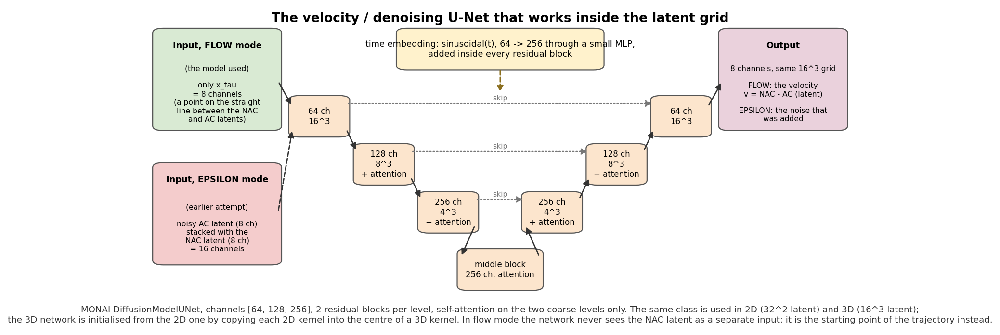

*Figure 4. The UNet used in both generative stages (3D sizes; the 2D version has the same channel widths). Left: the flow branch takes only the mixed code x_τ (8 channels). Right: the epsilon branch takes the noisy AC code stacked with the NAC code (16 channels). Everything else is shared.*

The network is MONAI's `DiffusionModelUNet`, a UNet (an encoder–decoder with skip connections at every resolution, named for its U-shaped diagram) with:

- channel widths [64, 128, 256] across three resolution levels, two residual blocks per level;
- self-attention at the two coarser levels (`attention_levels: [False, True, True]`), so every position at 8³ and 4³ resolution (in 3D) can look at every other position, which is what lets the network use body-wide context to infer attenuation;
- a time embedding: the step index t is encoded as a vector of sines and cosines of different frequencies, passed through a small two-layer network, and added inside every residual block, so the network knows how far along the line it is;
- 8 output channels (the velocity, or the noise, in latent space).

The 2D flow network has 11.1 million parameters; its 3D inflation has 29.0 million, the increase coming from the extra depth dimension of every kernel. The early epsilon runs used a much smaller network (0.70 million parameters in 2D, 1.20 million in 3D), which is one of several differences that make the epsilon-versus-flow comparison in Section 6.4 a comparison of *projects*, not a controlled ablation; that section says so.

Training settings shared by both generative stages: AdamW optimiser; a learning-rate schedule with a linear warm-up over min(500, total/10) steps followed by a cosine decay to 10 percent of the peak; an exponential moving average (EMA) of the weights with decay 0.9999, which is what inference uses by default; bfloat16 mixed precision with TF32 matrix multiplication on; channels-last memory layout; `torch.compile` where available; no gradient clipping. The 2D stage uses batch 16 at learning rate 10⁻⁴ for 100,000 steps; the 3D stage uses batch 1 with 16-step gradient accumulation (an effective batch of 16 volumes) at learning rate 5·10⁻⁵ for 30,000 steps. Validation runs every 2,500 steps on 8 (2D) or 4 (3D) held-out batches.

### 5.5 Inflation: turning a trained 2D network into a 3D network

**The operation.** A 2D convolution with kernel W₂ of shape (out, in, k, k) becomes a 3D convolution with kernel W₃ of shape (out, in, k, k, k) by

```
W₃[:, :, k//2, :, :] = W₂        (the centre depth slice gets the 2D kernel)
W₃[:, :, other depth slices]  = 0
```

with the bias copied unchanged (`inflate_conv2d_to_3d` in `src/training/models/inflation.py`). At initialisation the 3D network therefore computes, for every depth slice, exactly what the 2D network computed on that slice; the zero taps are the "depth taps" that training then fills in. Batch-norm-free layers (group normalisation, attention, time embedding) have the same parameter shapes in 2D and 3D and are copied directly.

**Matching by name and shape.** `plan_inflation` walks the two state dictionaries and returns four lists: keys copied directly, keys inflated, keys in the 3D model with no 2D source (left at their fresh initialisation), and keys whose shapes cannot be reconciled. The plan is printed at the start of every 3D run so that a wrong warm-start is visible in the log rather than silent. One case is deliberately left fresh: when a *flow* 3D network is inflated from a *flow* 2D network, all shapes match (8 → 8 input channels); but inflating from an *epsilon* 2D network into a flow 3D network leaves the input convolution fresh, because 16 input channels cannot be copied into 8. The 3D autoencoder's down-sampling convolutions are the other special case: the 2D ones have stride 2 in height and width; the 3D ones also stride 2 in depth, which is what makes the 3D code 16³ from a 64³ volume.

**The centre-freeze option.** Filling in the depth taps with a full learning rate also disturbs the copied 2D weights before the depth taps carry any signal. `build_center_freeze_plan` and the `CenterFreeze` helper implement a gradient-masked warm-start: for the first `inflate_unfreeze_step` steps, gradients on the copied centre slice of every inflated kernel (and on every directly copied tensor) are zeroed after each backward pass, so only the depth taps and the fresh layers move; then all weights are released. It is switched on with `inflate_freeze_backbone: true`; it is off in every run reported in Section 6 and is kept as an option for future work. Two MONAI details had to be handled: the UNet's final output convolution is zero-initialised by the library, so a *fresh* output layer makes the network output exactly zero until it trains (the first validation of such a run reads as a constant predictor, which is not a bug); and the attention blocks carry a `proj_attn` parameter that is never used in the forward pass, so it never receives a gradient and has to be excluded from any "every parameter moved" check. Both are covered by tests.

**What inflation is and is not.** It is a warm-start of *filters*. It is not a match of *latent distributions*: the 2D generative model was trained on codes from the 2D autoencoder, and the 3D model runs on codes from the 3D autoencoder, whose latent space is different (it compresses depth). The 3D model therefore has to re-learn the meaning of its inputs; the inflation only saves it from re-learning edge and texture filters. Section 6.3 shows how much of the 2D quality survives the transfer.

### 5.6 Shaping the loss beyond the plain squared error

The plain flow loss of Section 5.3.2 is the control arm of every experiment. Four additions were built, each aimed at the under-dispersion of Section 5.3.6. Their measured effect is in Section 6; this section explains what they are and why they were expected to help.

#### 5.6.1 Perceptual losses, and the three defects that had to be fixed first

A *perceptual loss* compares two images through the intermediate feature maps of a pretrained network instead of voxel by voxel. It rewards correct edges and texture where a voxel-wise loss rewards a blurry average. The original backend is VGG-16 (a 2014 image-classification network) applied slice by slice ("2.5D": a 3D volume is scored as a stack of 2D slices, so the depth direction is not seen by the perceptual network). The project's first perceptual runs gave no gain at all, and an audit found three defects:

1. **Intensity blindness.** Each slice was standardised to zero mean and unit variance before entering VGG, so the loss could not see a brightness error. For PET, brightness *is* the quantity of interest. Fix: feed the normalised intensities directly (scaled once to the input range VGG expects), so a globally dim prediction is penalised.
2. **Applied where the estimate is meaningless.** In the diffusion stage the loss was applied to the one-step clean estimate x̂₀ at *every* noise level. At high noise that estimate is mostly noise, so the perceptual gradient was mostly noise too. Fix: in flow mode, apply it to the exact endpoint estimate ÂC = x_τ − τ·v̂ (Section 5.3.5), which is meaningful at every τ; in epsilon mode, restrict it to low-noise steps.
3. **Too heavy.** The term dominated the reconstruction term. Fix: weight 0.1 relative to the L1 term for the autoencoders.

After these fixes the autoencoders were retrained (the `_p` runs), which is where the +6 dB improvement of the 2D autoencoder and the +4.6 dB of the 3D one came from (Section 6.3).

**Latent perceptual loss (LPL).** Decoding a latent to voxels and running VGG on every slice is slow and memory-hungry in 3D. The *latent perceptual loss* (Berrada et al., 2024, "Boosting latent diffusion with perceptual objectives", arXiv 2411.04873) compares instead the intermediate feature maps of the frozen autoencoder *decoder* when it is fed the predicted latent and the true latent. The class `LatentDecoderPerceptualLoss` in `src/training/utils/perceptual.py` implements it; it declares `consumes_latents=True` so the training loop hands it latents rather than decoded volumes. Measured on this hardware it is about 2.4 times faster and uses about 2.8 times less graphics memory than the decode-then-VGG path. Because decoder features have a different scale from VGG features, its weight in the configuration is 100 rather than 0.1.

#### 5.6.2 The (1 − τ) weighting from the rectified-flow literature

Lee et al. (2024) recommend weighting the velocity loss by (1 − τ) together with the U-shaped τ sampling of Section 5.3.5. The intuition offered there is that velocity errors near the data end (τ near 0 in this project's convention) matter more because the trajectory is about to end. The `loss_weighting: rfpp` option implements it. Two facts made it a poor fit here and predicted, correctly, that it would hurt:

- The average weight over uniform τ is ∫₀¹ (1 − τ) dτ = ½, so the regression signal is halved unless the learning rate is doubled to compensate (it was not, to keep the control matched).
- The weight is near zero at τ near 1, which is the *start* of the sampler and the region in which, by Section 5.3.5, the network has to produce the regression estimate E[AC | NAC]. Down-weighting precisely that region is the opposite of what a bridge that starts at the NAC needs.

Section 6.8 reports the outcome (worse by 1.0 dB).

#### 5.6.3 Where the gradient goes: spatial weight maps

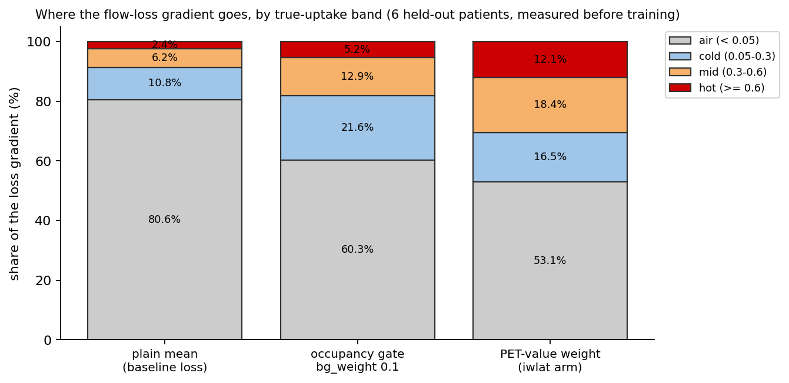

*Figure 12. Share of the squared-error gradient that comes from each intensity band of the true AC volume, on the 16³ latent grid, for the plain loss and for the two weight maps. The bands are defined on the true AC pooled to the latent grid; the exact thresholds are in `scripts/_diag_intensity_weight.py`.*

A latent grid of 16³ positions covers the whole volume, and most of that volume is air or cold tissue. Measured on the training set, 80.6 percent of the plain squared-error gradient comes from background positions and only 2.4 percent from the hottest band, the band the hot-band metric scores. The loss barely looks at what the clinician looks at. Two weight maps were built to change that (`src/training/utils/quant_losses.py`, both assembled by `build_latent_weight`):

- **Occupancy weight** (`latent_occupancy_weight`): a foreground mask (voxel above 5 percent of the volume maximum, in either the NAC or the AC), average-pooled to the latent grid, with a floor `bg_weight` (0.1) on the background so that the model still learns to keep air dark. Gradient share becomes 60.3 / 21.6 / 12.9 / 5.2 percent across the four bands.
- **Intensity weight** (`latent_intensity_weight`): the true AC volume itself, pooled to the latent grid (average or maximum pooling), divided by its 99th percentile, raised to a power `gamma` (1.0), clipped at 1, with the same floor. Gradient share becomes 53.1 / 16.5 / 18.4 / 12.1 percent: the hottest band gets five times its plain share.

Both maps are divided by their mean, so the average weight is 1 and the effective learning rate does not change; the arm and its control differ only in *where* the gradient goes. The weight is always computed from the *true* AC, which is known at training time. It must never be computed from the prediction: a model that could raise the weight of a voxel by predicting a high value there would be rewarded for inventing uptake. The code carries this warning.

#### 5.6.4 Losses that move the target away from the mean

Three further terms in `quant_losses.py` are the "route 3" of Section 5.3.6. Each can be switched on through the `quant:` block of a configuration and is combined with the flow loss by `build_quant_loss`:

- `expectile_loss(q = 0.7)`: an asymmetric squared error that penalises under-prediction more than over-prediction, whose minimiser is the 70th expectile rather than the mean. This deliberately trades squared error for calibration in the upper tail.
- `intensity_weighted_l1(lam = 4)`: an absolute-error term whose weight grows with the true intensity.
- `slope_penalty`: the squared difference between the least-squares regression slope of prediction on truth within the batch and 1. It attacks the slope metric directly; Section 6.9 shows that it moves the slope and nothing else.

### 5.7 The inference path

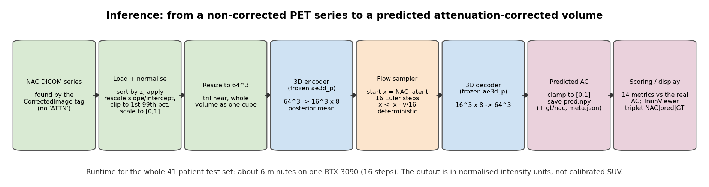

*Figure 6. Inference. The autoencoder's encoder and decoder and the 3D flow network are loaded from their checkpoints; the exponential-moving-average weights are used by default. All shapes are for the 64³ chain.*

`python -m src.training.infer` runs the following for one patient (and `python -m src.training.evaluate` runs it for a whole split and writes the per-patient metrics to `outputs/eval/<run>/`):

1. Read the NAC volume from the float16 cache (or from DICOM if not cached), normalise it with its own 1st and 99th percentile, resize it to 64³ with trilinear interpolation.
2. Encode it with the 3D autoencoder; keep the posterior mean; multiply by the latent scale (1.0 for flow checkpoints, stored in the checkpoint's configuration).
3. Run the Euler rollout of Section 5.3.4 from τ = 1 to 0. All reported 3D results use 16 steps with linear spacing; the 2D results use 8. A flow checkpoint ignores guidance weights.
4. Decode the resulting latent with the 3D autoencoder and clamp the volume to [0, 1] (`clamp_unit`; on by default, `--no_clamp_output` turns it off). Clamping is legitimate because the truth is in [0, 1] by construction (Section 4.5), and it adds about 0.15 dB by removing decoder overshoot below zero and above one.
5. Write `pred.npy`, `gt.npy` (when an AC exists) and `meta.json` (patient identifier, shapes, steps, spacing, checkpoint paths) to `outputs/infer/<task>/`.

The whole 41-patient test set takes about six minutes on one RTX 3090 at 16 steps, including data loading; the network work is a fraction of that. `--no_ema` selects the raw weights instead of the averaged ones; every number in this report uses the averaged weights.

### 5.8 How predictions are scored

All metrics (`src/training/utils/image_metrics.py`) are computed per patient on the clamped 64³ prediction against the 64³ ground truth, both in normalised intensity, and then averaged over patients; the spread across patients is reported as a standard deviation. "Foreground" means voxels where the truth exceeds 5 percent of its maximum. The 14 metrics fall into three groups.

**Picture quality.**

- Peak signal-to-noise ratio (PSNR), 10·log₁₀(1 / mean squared error), with the data range fixed at 1. Higher is better; each 3 dB halves the squared error.
- Structural similarity index (SSIM), computed in 3D with a Gaussian window of size 7 and standard deviation 1.5. Ranges up to 1 for identical volumes.
- Normalised root-mean-square error (NRMSE) and mean absolute error (MAE), lower is better.

**Calibration (does the prediction reach the true intensities?).** These are the metrics that separate "looks right" from "is right", and they are the ones that all the loss-shaping work targets.

- Regression slope and intercept of the least-squares line pred = slope·gt + intercept over foreground voxels. Slope 1 and intercept 0 is perfect scale; Section 5.3.6 explains why slope < 1 is expected.
- Voxel coefficient of determination (voxel R²), 1 − Σ(pred − gt)² / Σ(gt − mean gt)², the fraction of the truth's variance the prediction explains. Negative values mean the prediction is worse than predicting the mean everywhere.
- Mean relative bias, (Σ pred − Σ gt) / Σ gt over foreground: the total uptake error.
- Hot-band relative error: the mean of the prediction over the voxels whose true value lies between the truth's 90th and 98th percentile, relative to the mean truth there. This is the project's proxy for the lesion-brightness error a radiologist would care about. The band stops at the 98th percentile on purpose: above the 99th the truth is a flat plateau at 1.0 (Section 4.5) and any error there is invisible.
- 95th-percentile relative error, (p95(pred) − p95(gt)) / p95(gt): a second, simpler tail measure.
- Bland–Altman limits of agreement (LoA): the mean of (pred − gt) and the interval mean ± 1.96 standard deviations of the voxel differences, the standard way of reporting agreement between two measurement methods in medical statistics.

**Retired.** The maximum relative error, (max pred − max gt) / max gt, is still computed for backward compatibility but is not reported: because of the 99th-percentile clipping the true maximum is always exactly 1.0, so the metric only measured decoder overshoot.

**Paired comparisons.** When two arms share a test set, their difference is assessed on per-patient differences: a paired t-test and a count of patients on which each arm wins. This is far more sensitive than comparing two means with error bars, because the per-patient spread (standard deviation 1.4 dB in PSNR) is much larger than the differences between arms (0.01 dB to 0.1 dB).

### 5.9 Infrastructure that makes the experiments repeatable

- **Checkpoints** (`src/training/utils/checkpointing.py`). Every stage writes `best.pt` (by the validation selection metric) and `last.pt` (every validation). A checkpoint holds the model weights, the averaged weights, the optimiser and scheduler state, the step counter, the random-number-generator states of Python, NumPy, PyTorch and CUDA, and the full configuration dictionary. Because the configuration is embedded, inference and the graphical tool rebuild the network from the checkpoint alone. `resolve_resume_path` finds the right file for `--resume`; `init_weights_from` loads a warm-start from another run, preferring the averaged weights, skipping tensors whose shape differs, and printing what it skipped.
- **Metrics** (`src/training/utils/metrics.py`). `MetricsWriter` appends one JSON row per logged step to `outputs/<run>/metrics.jsonl` and to a per-run copy under `outputs/<run>/runs/<run_id>/`, so that a resumed run does not overwrite the history of the run it continues. Rows carry `phase` = train or val and the step.
- **Data feeding** (`src/training/data.py`). `PrefetchingPatientCache` keeps a bounded set of decoded patient volumes in memory and refills it from a background thread; `--cache_size`, `--prefetch` and `--patient_reuse` (how many batches are drawn from one loaded patient before it is replaced) tune the trade-off between disk traffic and sample diversity. `filter_paired_patients_cached` remembers which patients have a pair, so the pairing scan of 628 folders is done once.
- **Precision and speed.** bfloat16 automatic mixed precision, TF32 matrix multiplication, channels-last layout, `torch.compile` when available, gradient accumulation for the 3D stage.
- **Launcher** (`src/training/train/launcher.py`). One entry point with the stage name as first argument; it is what the graphical tool and every driver script call.
- **Tests** (`src/tests/`, 306 test functions). They cover the model constructors, one training step of each stage on the CPU with a tiny configuration, the flow loss and sampler identities of Section 5.3 (including the leak and the step-invariance claim), the U-shaped sampler's symmetry, the inflation plan and centre-freeze, the quantitative losses, resume, the metrics, and the two graphical tools' logic.

---

## 6. Experiments and results

### 6.1 Protocol

- **Hardware and software.** One NVIDIA RTX 3090 (24 GB) under Windows Subsystem for Linux (Ubuntu 24.04), PyTorch 2.11 with CUDA 12.8, MONAI. Exact package versions are in `requirements.txt`.
- **Test sets.** All 3D arms share the 41 test patients of `outputs/ft3d_flow_p/split.json` (Section 4.7), except `ft3d_flow_lpl_rfpp`, which is compared on the 23 patients its own split shares with that set. The 2D flow arms are scored on the 41 test patients of their own split; 2D and 3D numbers are therefore indicative of each other, not paired. The three epsilon runs were evaluated on 19 test patients, before the NAC classifier fix doubled the paired cohort.
- **Evaluation resolution.** 3D arms: the whole 64³ volume (128³ for the doubled chain). 2D arms: 32 axial slices per patient at 128×128, each slice translated independently.
- **Sampler settings.** Averaged (EMA) weights; linear step spacing; 16 Euler steps for 3D, 8 for 2D; output clamped to [0, 1] unless stated. Epsilon arms: DDIM, 25 steps, Karras spacing, clip_x0 = 4.
- **Selection.** Every checkpoint is chosen on the validation set (Section 5.3.5); the test set is scored once per arm.
- **Statistics.** Means and standard deviations across patients; paired t-tests and win counts for arms that share a test set. Every number below is recomputed from `outputs/eval/*/*.json` and `outputs/*/metrics.jsonl` by `scripts/make_report_figures.py`.

### 6.2 Chronology

| When | What happened | Outcome |
| --- | --- | --- |
| 2026-01 to 2026-05 | Earlier phase of the project: DICOM viewer, SUV and Hounsfield-unit display, organ segmentation, prostate locator and zone-of-interest box | Delivered; still in the repository (`src/DataViewer`, `src/utils`) |
| 2026-05-24 | Training scaffolding: four stages, launcher, tests | |
| 2026-06-05 to 06-07 | First training runs; ACRIN NAC/AC loading fix; multi-plane slicing; TrainViewer web tool; evaluation utilities | Epsilon diffusion trains but generation is structureless |
| 2026-06-13 | Classifier-free guidance, latent scaling, clipping of the clean estimate, caching | Guidance lifts 2D SSIM from 0.18 to 0.36; still far below the input's 0.43 |
| 2026-06 to 07 | Diagnosis: the model ignores the NAC. Flow bridge designed, implemented and tested in 2D; first true-flow run after a silent-configuration bug was found | 2D flow reaches 25.7 dB (from 14.3 dB) |
| 2026-07-11 | Full-data 3D flow chain trained | Test SSIM 0.923, R² 0.69: the deliverable model |
| 2026-07 to 08 | Perceptual-loss audit and fix; autoencoders retrained (`_p`); latent perceptual loss; flow-side loss shaping; metrics for the hot band; split-leak found, `--split_json` added | Autoencoders +6.2 dB (2D) and +4.6 dB (3D) |
| 2026-08-07 | Perceptual + (1 − τ) + U-shaped arm scored | Significantly worse (Section 6.8) |
| 2026-08-09 | NAC classifier bug found and fixed (paired cohort 410); twelve-arm fine-tune ablation | Ablation is inert (Section 6.9) |
| 2026-08-21 | PET-value weighting vs matched control, 6,000 steps | Small, very consistent gain (Section 6.10) |
| 2026-08 to 09-02 | Doubled-resolution chain (128³); resolution-loss and headroom diagnostics; this report | 128³ chain worse within budget (Section 6.7) |

### 6.3 Main results: autoencoders, 2D flow, 3D flow

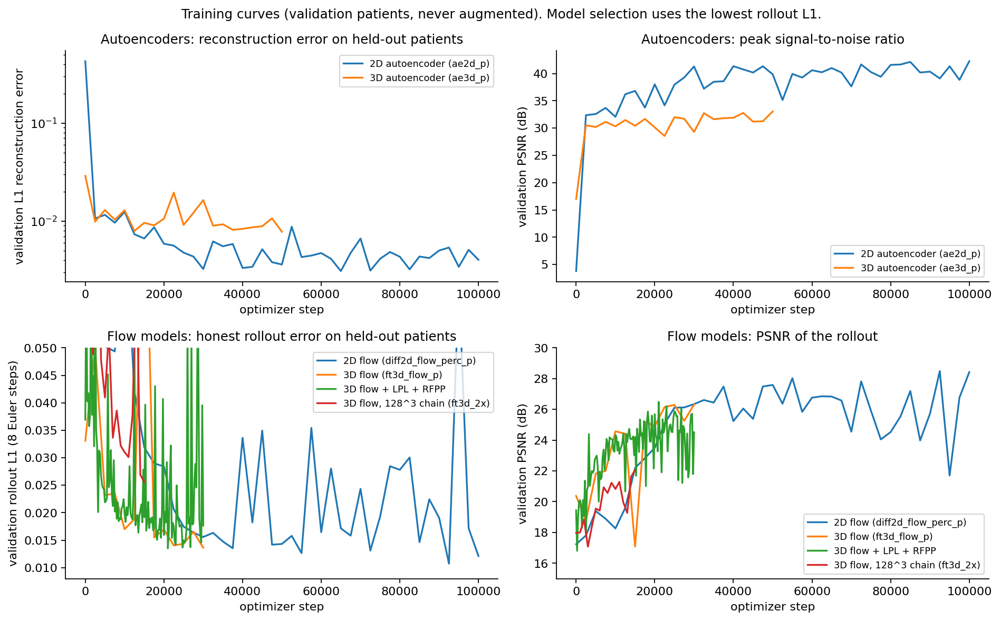

*Figure 8. Validation curves of the four delivered stages (autoencoders: L1 reconstruction error; flow stages: L1 of the 8-step rollout against the true AC code). The dot marks the selected checkpoint.*

**Validation endpoints of the delivered chain.**

| Stage | Selected step | Validation metric | Validation PSNR (dB) | Validation SSIM |
| --- | --- | --- | --- | --- |
| `ae2d_p` (2D autoencoder) | 65,000 | recon L1 0.003089 | 41.00 | 0.9931 |
| `ae3d_p` (3D autoencoder) | 50,000 | recon L1 0.007777 | 33.05 | 0.9787 |
| `diff2d_flow_perc_p` (2D flow) | 92,500 | rollout L1 0.010716 | 28.49 | 0.9509 |
| `ft3d_flow_p` (3D flow) | 30,000 | rollout L1 0.013633 | 26.32 | 0.9493 |

For comparison, the autoencoders trained before the perceptual fix reached 34.78 dB (2D) and 28.42 dB (3D) on validation. The fix (Section 5.6.1) is worth 6.2 dB and 4.6 dB respectively, more than any other single change in the project.

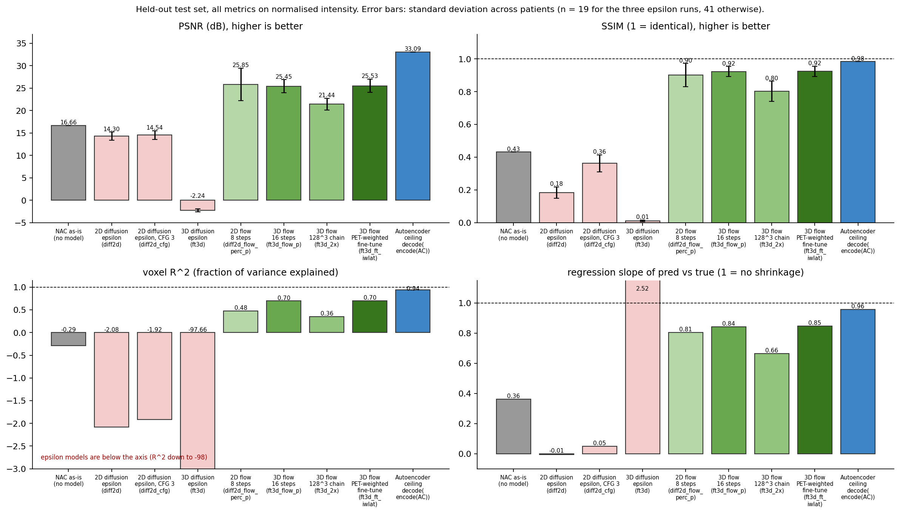

*Figure 9. Test-set results by model family. Grey: the uncorrected input scored against the truth. Red: noise-based diffusion. Greens: flow bridges. Blue: the autoencoder ceiling, that is the truth encoded and decoded without any generative model.*

**Test-set results of the main arms.** All metrics on normalised intensity; mean ± standard deviation across patients where available.

| Arm | n | PSNR (dB) | SSIM | NRMSE | MAE | voxel R² | slope | intercept | rel. bias | hot band | p95 |
| --- | --- | --- | --- | --- | --- | --- | --- | --- | --- | --- | --- |
| NAC as-is (no model) | 41 | 16.66 | 0.432 | | | −0.286 | 0.363 | | +0.161 | −0.243 | |
| `diff2d_flow_perc_p`, 2D flow, 8 steps | 41 | 25.85 ± 3.59 | 0.902 ± 0.071 | 0.0596 | 0.0198 | 0.477 | 0.805 | 0.065 | −0.011 | | |
| **`ft3d_flow_p`, 3D flow, 16 steps** | 41 | **25.45 ± 1.44** | **0.923 ± 0.031** | 0.0542 | 0.0164 | **0.699** | **0.842** | 0.059 | **−0.0035** | **−0.100** | −0.031 |
| Autoencoder ceiling, decode(encode(AC)) | 41 | 33.09 | 0.984 | | | 0.944 | 0.957 | | | −0.029 | |

Bland–Altman on `ft3d_flow_p`: mean difference −0.001, limits of agreement −0.268 to +0.265 (normalised units).

*Reading the table.*

- The uncorrected input is 24 percent too dim in the hot band and 16 percent too bright in total (the halo at the body edge adds signal where there should be little). The 3D model brings the total bias to −0.35 percent and the hot-band error to −10 percent.
- The 2D model has a slightly higher mean PSNR but a two and a half times larger spread across patients (3.59 dB versus 1.44 dB), a much lower R² (0.48 versus 0.70) and lower SSIM. The 2D number is also measured on 32 slices at 128² rather than on the volume, so the two rows are not directly comparable. The 3D model is the deliverable because it is volumetric, consistent across slices and far more stable across patients.
- The gap between the 3D model (25.45 dB, slope 0.84) and the autoencoder ceiling (33.09 dB, slope 0.96) is what the generative stage still leaves on the table; Section 6.6 splits it.

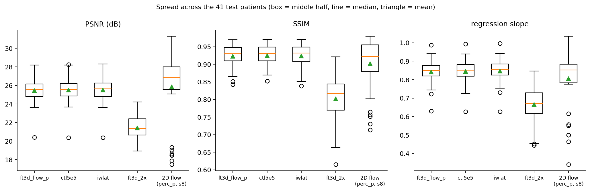

*Figure 15. Per-patient test metrics of the 3D flow model against the uncorrected input, one point per patient. Every patient improves.*

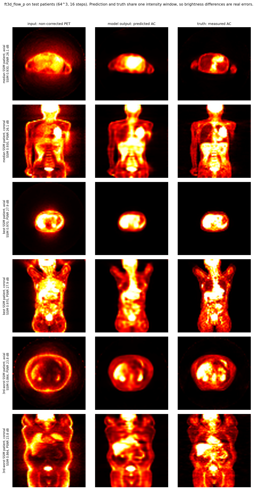

*Figure 16. Input, prediction and truth for three test patients chosen by their rank on SSIM: the median patient (SSIM 0.930, 26.1 dB), the best (0.970, 27.9 dB) and the third-worst (0.864, 23.8 dB). Axial, coronal and sagittal slices through the volume centre. Generated by `scripts/report_triplets.py`.*

In the pictures the model removes the body-edge halo, restores the deep organs, and reproduces the liver, heart and bladder uptake. Its typical failures are a slightly too-smooth appearance of small hot spots (the under-dispersion of Section 5.3.6) and, on the third-worst patient, an arm position outside the usual range that the model partly mis-corrects.

### 6.4 Why noise-based diffusion failed, and what guidance did

| Arm | n | PSNR (dB) | SSIM | NRMSE | MAE | R² | slope | rel. bias |
| --- | --- | --- | --- | --- | --- | --- | --- | --- |
| `diff2d`, 2D epsilon, DDIM 25 | 19 | 14.30 ± 0.90 | 0.185 | 0.196 | 0.100 | −2.08 | −0.006 | −0.797 |
| `diff2d_cfg`, 2D epsilon, guidance 3 | 19 | 14.54 | 0.362 | 0.192 | 0.088 | −1.92 | 0.049 | −0.785 |
| `ft3d`, 3D epsilon | 19 | −2.24 | 0.012 | 1.295 | 0.717 | −97.7 | 2.52 | +3.77 |

A slope of −0.006 with a total bias of −80 percent describes an output that is essentially dark and unrelated to the truth; the 3D epsilon model's output exploded (a bias of +377 percent even after clipping). Meanwhile their *validation* numbers looked reasonable (2D: L1 0.0128 at 249,000 steps). The validation metric was the one-step clean estimate x̂₀ at a random noise level, which at low noise is almost equal to the noisy input itself; it measured denoising, not generation. This is the concrete reason the flow branch selects checkpoints on a real rollout.

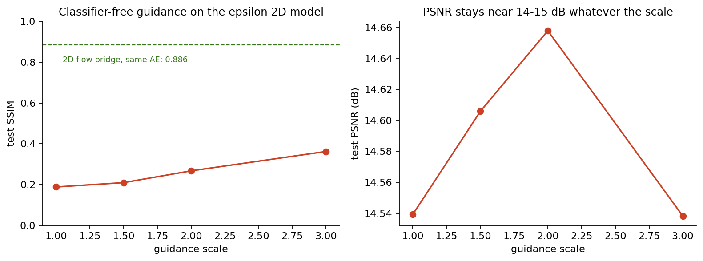

*Figure 18. Classifier-free guidance weight against SSIM and PSNR for the 2D epsilon model (19 test patients). SSIM rises with the weight; PSNR does not move.*

Guidance weights 1, 1.5, 2 and 3 gave SSIM 0.188, 0.209, 0.267, 0.362 and PSNR 14.54, 14.61, 14.66, 14.54 dB. Guidance amplifies whatever dependence on the NAC the model has; the rising SSIM shows that dependence exists but is weak, and the flat PSNR shows that amplifying it does not make the intensities right. The interpretation adopted was that a model that must build the AC from noise and is merely *informed* about the NAC through extra channels learns the marginal distribution of AC codes first and the conditional dependence only weakly; with 287 training patients it never gets to the second part.

*Two honesty notes.* The epsilon networks were much smaller (0.70 million and 1.20 million parameters against 11 and 29 million), the paired cohort was half the size, and the test set was 19 patients: this is a comparison of two project phases, not a controlled ablation. The project did not spend budget scaling the epsilon arm up because the flow arm, which is structurally forced to start from the NAC, answered the question. Second, the *first* run labelled "flow" was in fact an epsilon run: the YAML library was missing from the WSL environment and the configuration loader fell back to defaults silently. Its tell was a strong dependence on the number of sampling steps (PSNR 15.8, 16.4, 16.1, 15.7 dB at 8, 16, 32, 64 steps; SSIM 0.12 to 0.31), which Section 5.3.4 says a straight-line bridge cannot have. The loader now fails loudly, and the step-invariance check became a standard diagnostic.

### 6.5 Step-count invariance


*Figure 13. Test PSNR against the number of Euler steps. Flow arms are flat; the mislabelled epsilon run is not.*

| Arm | 8 steps | 16 steps | 32 steps |
| --- | --- | --- | --- |
| `diff2d_flow_perc_p` (2D) | 25.846 | 25.767 | 25.725 |
| `diff2d_flow2` (2D, first true flow) | 25.698 | 25.609 | 25.570 |
| `ft3d_flow_p` (3D, unclamped) | | 25.294 | 25.247 |
| `ft3d_2x` (3D, 128³) | | 21.439 | 21.405 |

A four-fold change in the number of steps moves PSNR by at most 0.13 dB, which confirms that the learned field is nearly straight (Section 5.3.4). The ordering is consistently *fewer steps is slightly better*. The reading of this is the one-step view of Section 5.3.5: the learned field is a conditional-mean field, each extra network evaluation adds a little estimation noise, and there is no curvature for the extra steps to correct. Sixteen steps were kept for the 3D results as a conservative choice; eight would serve as well.

### 6.6 Under-dispersion, headroom and the cost of resolution

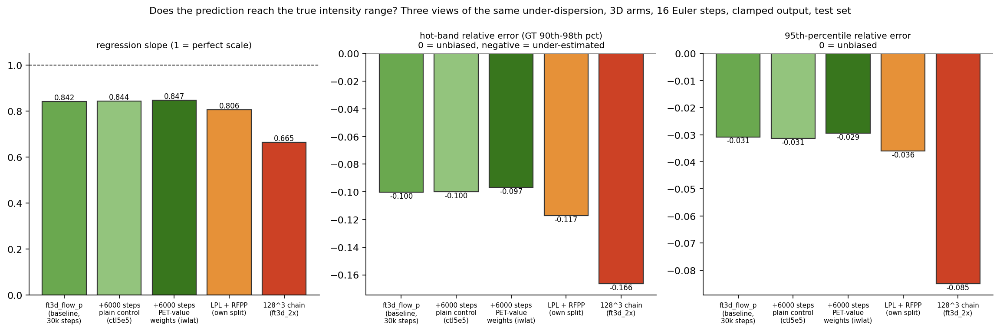

*Figure 10. Three views of the same defect across the 3D arms: regression slope, hot-band relative error, and 95th-percentile relative error.*

All 3D arms trained at 64³ sit at a slope of 0.81 to 0.85 and a hot-band error of −10 to −12 percent; the 128³ arm, under-trained, sits at 0.67 and −17 percent.

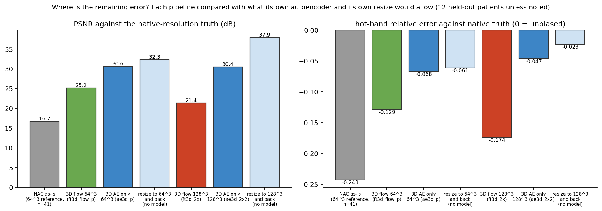

*Figure 14. Where the remaining error lives. For each metric: the uncorrected input, the 3D flow model, and the autoencoder ceiling (truth encoded and decoded). The distance from the flow bar to the ceiling bar is the flow model's own error; the distance from the ceiling to perfection is the autoencoder's.*

| Metric | NAC input | `ft3d_flow_p` | Autoencoder ceiling | Perfect |
| --- | --- | --- | --- | --- |
| PSNR (dB) | 16.66 | 25.45 | 33.09 | ∞ |
| voxel R² | −0.286 | 0.699 | 0.944 | 1 |
| slope | 0.363 | 0.842 | 0.957 | 1 |
| hot band | −0.243 | −0.100 | −0.029 | 0 |

For PSNR, R² and slope the flow model is the bottleneck: 7.6 dB of headroom before the autoencoder limits anything. For the hot band the autoencoder already costs 3 of the 10 points. Both are consistent with Section 5.3.6: the flow model's defect is mis-placed variance, and the autoencoder's is a mild smoothing of the top of the intensity range.

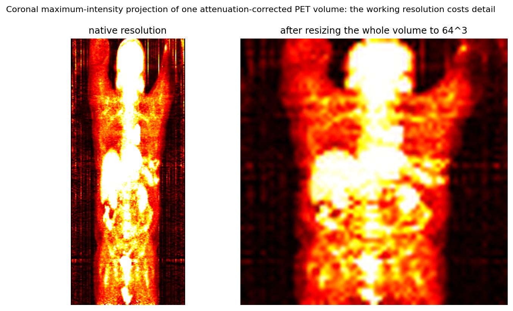

*Figure 17. Scoring against the AC volume at its native scanner resolution (12 test patients). "Resize" is the truth down-sampled to the working grid and up-sampled back, so it isolates the cost of the grid; "autoencoder" adds the encode–decode cost; "flow" is the full prediction.*

| Working grid | Resize only | Autoencoder | Flow | | Resize only | Autoencoder | Flow |
| --- | --- | --- | --- | --- | --- | --- | --- |
| | PSNR (dB) | | | | hot band | | |
| 64³ | 32.34 | 30.60 | 25.18 | | −0.061 | −0.068 | −0.129 |
| 128³ | 37.92 | 30.45 | 21.36 | | −0.023 | −0.047 | −0.174 |
| NAC input | | | | | −0.243 | | |

Against the native truth, down-sampling to 64³ *alone* dims the hot band by 6 percent: a small hot lesion is averaged with its cold neighbours when its voxels are merged. Half of the flow model's 13 percent hot-band error against native truth is therefore the grid, not the model. Doubling the grid cuts the grid cost to 2 percent, but the 128³ autoencoder trained within this project's budget is no better than the 64³ one (30.45 versus 30.60 dB), and the 128³ flow model is far worse. Resolution is the right lever, and it needs a training budget the project did not have (Section 6.7).

**Recalibration, and why it was not shipped.** On the 24-patient clean intersection, fitting a global linear rescaling of the prediction raised the slope from 0.843 to 0.945 and *lowered* PSNR from 25.64 to 24.88 dB (−0.76 dB). Section 5.3.6 predicted −0.7 dB for exactly this slope change from the measured R² and slope alone. The model would read as better calibrated while being less accurate, so the raw prediction is what is delivered; the rescaling is available as a diagnostic (`scripts/_diag_recalibrate.py`).

### 6.7 The doubled-resolution chain (128³)

The 128³ chain doubles every axis and the latent channel count (16 instead of 8), adds a fourth resolution level to the 3D autoencoder (`--extra_levels 1`, so 128³ → 16³ again), and warm-starts every stage from the corresponding 64³ stage.

| Stage | Steps | Starts from | Validation | Parameters |
| --- | --- | --- | --- | --- |
| `ae2d_2x` | 30,000 | `ae2d_p` | recon L1 0.00221 (44.51 dB) | |
| `ae3d_2x2` | 25,000 | `ae2d_2x`, inflated | recon L1 0.00953 (30.58 dB) | 144.0 M (1.72 GB) |
| `diff2d_2x_long` | 30,000 | `diff2d_flow_perc_p` | rollout L1 0.01154 | |
| `ft3d_2x` | 15,000 | `diff2d_2x_long`, inflated | rollout L1 0.02558 (22.06 dB) | 29.0 M |

Test (41 patients, 16 steps, clamped): PSNR 21.44 ± 1.31 dB, SSIM 0.802, NRMSE 0.0857, MAE 0.0301, R² 0.356, slope 0.665, intercept 0.154, relative bias +0.068, hot band −0.166, p95 −0.085. Worse than the 64³ chain on every metric. The chain received half the steps of the 64³ chain on samples with eight times the voxels, and the 3D autoencoder at 128³ has four times the parameters of the 64³ one. The ceiling analysis above says the route is sound; the result says it is unfinished. The configurations and driver (`scripts/_chain_2x.sh`) are in the repository for whoever continues it.

### 6.8 Perceptual loss with the rectified-flow recipe: worse

`ft3d_flow_lpl_rfpp` combined three changes from the literature on top of the 3D flow control: latent perceptual loss (weight 100), U-shaped τ sampling (a = 4), and (1 − τ) loss weighting; batch 4 with 4-step accumulation instead of 1 with 16. Its validation rollout L1 (0.013514 at 21,000 steps) was marginally *better* than the control's (0.013633), and its test results were clearly worse:

| Arm | n | PSNR | SSIM | NRMSE | MAE | R² | slope | intercept | hot band | p95 |
| --- | --- | --- | --- | --- | --- | --- | --- | --- | --- | --- |
| `ft3d_flow_lpl_rfpp` (own split) | 41 | 24.55 | 0.909 | 0.0599 | 0.0181 | 0.634 | 0.806 | 0.075 | −0.117 | −0.036 |

On the 23 shared test patients the arm loses to the control on 22 (one win), by 1.0 dB PSNR on average. Three changes were made at once, so the attribution is by argument rather than by measurement: the (1 − τ) weighting halves the regression signal and removes it exactly where the sampler starts (Section 5.6.2). The batching change is a second unresolved confound. The lesson recorded for the project was procedural: one change per arm, and a matched control in the same launch.

### 6.9 A fine-tune ablation that moved nothing, and why

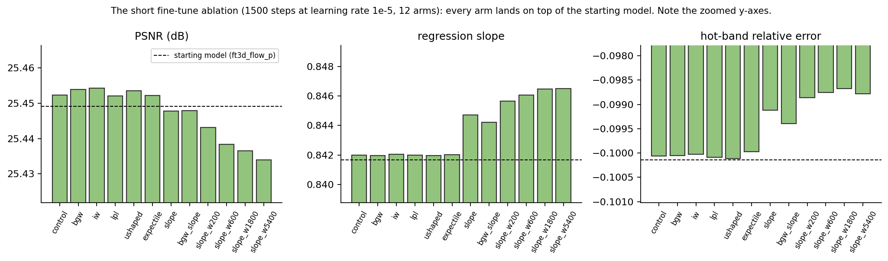

*Figure 19. Twelve fine-tune arms of 1,500 steps at learning rate 10⁻⁵ from the 3D flow model. Only the slope penalty moves the slope, and it pays in PSNR.*

| Arm | PSNR (dB) | slope | hot band |
| --- | --- | --- | --- |
| control | 25.4523 | 0.84199 | −0.10006 |
| occupancy weight (bgw) | 25.4539 | 0.84197 | |
| intensity weight (iw) | 25.4542 | 0.84205 | |
| latent perceptual (lpl) | 25.4521 | 0.84200 | |
| U-shaped τ | 25.4535 | 0.84197 | |
| expectile 0.7 | 25.4522 | 0.84202 | |
| slope penalty | 25.4478 | 0.84472 | −0.09912 |
| occupancy + slope | 25.4479 | 0.84421 | |
| slope penalty, weight 200 | 25.4432 | 0.84566 | |
| weight 600 | 25.4384 | 0.84605 | |
| weight 1,800 | 25.4365 | 0.84646 | |
| weight 5,400 | 25.4339 | 0.84651 | −0.09878 |

Every non-slope arm is within 0.002 dB and 0.0001 of slope of the control, far below any meaningful difference. There is a numerical reason. Inference uses the exponential moving average of the weights with decay 0.9999, and the fine-tune starts the average at the loaded weights. After 1,500 steps the average still gives weight 0.9999¹⁵⁰⁰ ≈ 0.86 to the starting point; after 6,000 steps, 0.55. Together with a learning rate five times lower than the training run's, the arms could not have moved the averaged weights measurably. The slope penalty is the exception because it attacks the scored quantity directly, and it shows the trade the theorem predicts: +0.0045 of slope for −0.02 dB. The corrected recipe (6,000 steps at 5·10⁻⁵, a matched control launched the same way, a fresh output folder) is what Section 6.10 uses.

### 6.10 PET-value weighting against a matched control

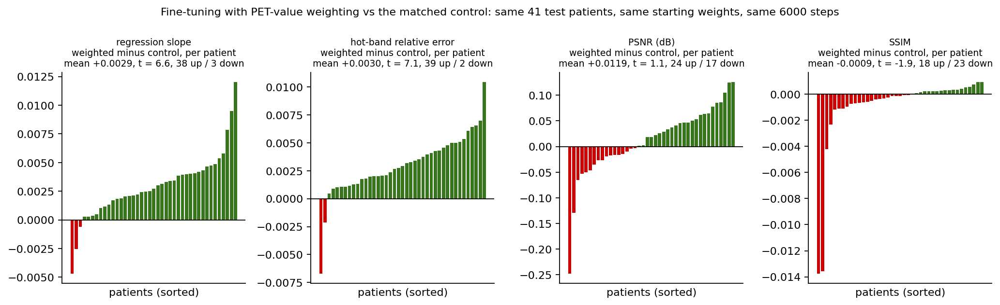

*Figure 11. Per-patient differences, intensity-weighted arm minus control, over the 41 shared test patients. Positive is better for slope and hot band. Slope and hot band improve on almost every patient; PSNR and SSIM do not move.*

Both arms start from `ft3d_flow_p/best.pt`, train 6,000 steps at 5·10⁻⁵ with batch 4 and 4-step accumulation on the same split and seed, and differ in one line of configuration: `latent_weight: intensity` (floor 0.1, source AC, gamma 1.0, 99th percentile, average pooling; Section 5.6.3) against no weight.

| Arm | PSNR | SSIM | NRMSE | MAE | R² | slope | intercept | rel. bias | hot band | p95 |
| --- | --- | --- | --- | --- | --- | --- | --- | --- | --- | --- |
| `ft3d_ft_ctl5e5` (control) | 25.519 | 0.9246 | 0.0537 | 0.0163 | 0.703 | 0.844 | | −0.0044 | −0.0999 | −0.0314 |
| `ft3d_ft_iwlat` (intensity weight) | 25.53 ± 1.47 | 0.9237 | 0.0537 | 0.0163 | 0.704 | 0.847 | 0.058 | −0.0013 | −0.0969 | −0.0295 |

| Paired difference (weighted − control) | mean | paired t | wins / losses |
| --- | --- | --- | --- |
| slope | +0.00295 | 6.59 | 38 / 3 |
| hot-band relative error | +0.00302 | 7.11 | 39 / 2 |
| PSNR (dB) | +0.012 | 1.13 | 24 / 17 (not significant) |
| SSIM | −0.0009 | −1.89 | 18 / 23 (not significant) |

The effect is small in size, 0.3 percentage points of hot-band error, and unusually consistent: 39 of 41 patients move in the predicted direction with a paired t-statistic above 7. It is a directed fix for a directed defect (Section 5.6.3 showed the plain loss gives the hot band 2.4 percent of its gradient), and it costs nothing on the picture-quality metrics. Its size is bounded by the same two facts as everything else in this section: the averaged weights are still 55 percent the starting point after 6,000 steps, and the theorem of Section 5.3.6 says only the mis-placed 0.14 of variance is fixable this way. Both fine-tunes also gain 0.07 to 0.08 dB over the 30,000-step baseline simply from training longer.

### 6.11 All arms at a glance

| Arm | Family | Test set | PSNR (dB) | SSIM | R² | slope | hot band | Verdict |
| --- | --- | --- | --- | --- | --- | --- | --- | --- |
| NAC as-is | none | 41 | 16.66 | 0.432 | −0.29 | 0.36 | −0.243 | baseline |
| `diff2d` | 2D epsilon | 19 | 14.30 | 0.185 | −2.08 | −0.01 | | collapsed |
| `diff2d_cfg` (w = 3) | 2D epsilon + guidance | 19 | 14.54 | 0.362 | −1.92 | 0.05 | | collapsed |
| `ft3d` | 3D epsilon | 19 | −2.24 | 0.012 | −97.7 | 2.52 | | exploded |
| `diff2d_flow_perc_p` | 2D flow | 41 (own) | 25.85 | 0.902 | 0.48 | 0.81 | | works |
| **`ft3d_flow_p`** | 3D flow | 41 | **25.45** | **0.923** | **0.70** | **0.84** | **−0.100** | **delivered** |
| `ft3d_ft_ctl5e5` | 3D flow, +6k steps | 41 | 25.52 | 0.925 | 0.70 | 0.84 | −0.100 | control |
| `ft3d_ft_iwlat` | 3D flow, +6k steps, PET-weighted | 41 | 25.53 | 0.924 | 0.70 | 0.85 | −0.097 | best calibrated |
| `ft3d_flow_lpl_rfpp` | 3D flow + perceptual recipe | 41 (own) | 24.55 | 0.909 | 0.63 | 0.81 | −0.117 | worse |
| `ft3d_2x` | 3D flow, 128³ | 41 | 21.44 | 0.802 | 0.36 | 0.67 | −0.166 | under-trained |
| Autoencoder ceiling | `ae3d_p` alone | 41 | 33.09 | 0.984 | 0.94 | 0.96 | −0.029 | upper bound |

---

## 7. The code: layout, contracts, status and known bugs

### 7.1 Layout

| Path | Contents |
| --- | --- |
| `src/training/data.py` | DICOM loading, NAC/AC classification, normalisation, resizing, slicing, augmentation hooks, patient splits, the prefetching cache |
| `src/training/dataset_index.py` | Torch-free enumeration of patients across several roots (shared with the web tool) |
| `src/training/precache.py` | The float16 cache builder (Section 4.4) |
| `src/training/models/` | `autoencoder2d.py`, `autoencoder3d.py` (MONAI AutoencoderKL wrappers), `diffusion2d.py`, `diffusion3d.py` (MONAI DiffusionModelUNet wrappers), `inflation.py` (2D→3D copy, plan, centre-freeze) |
| `src/training/train/` | `train_ae2d.py`, `train_ae3d.py`, `train_diff2d.py` (holds `flow_loss`, `sample_flow_timesteps`, `_selection_metric`, the epsilon path and the validation loop), `train_ft3d.py` (3D generative stage; reuses the 2D loss functions), `launcher.py` |
| `src/training/utils/` | `sampling.py` (`DiffusionSchedule`: cosine and linear schedules, DDIM, Karras spacing, `flow_sample`), `schedule.py` (learning-rate warm-up and cosine decay, EMA), `checkpointing.py`, `metrics.py` (JSONL writer), `image_metrics.py` (the 14 metrics), `perceptual.py` (VGG and latent perceptual losses), `quant_losses.py` (weight maps, expectile, slope penalty), `augment.py`, `translate.py` (the shared NAC→AC helper used by inference, evaluation and the web tool), `prefetch_batches.py`, `perf.py`, `logging.py`, `amp.py` (unused, see 7.6) |
| `src/training/infer.py`, `evaluate.py` | One-patient inference; whole-split evaluation |
| `src/training/configs/` | One YAML per stage and per experimental arm (28 files); `ablation/` holds the generated 2D autoencoder ablation configs |
| `src/TrainViewer/` | The Gradio web tool: `model.py` (subprocess and file backend), `controller.py` (UI-agnostic logic), `app.py` (the UI), `main.py` |
| `src/DataViewer/` | The Tkinter desktop viewer: `model.py` (DICOM data and locator bridge), `presenter.py`, `view.py`, `main.py` |
| `src/utils/` | `geometry.py` (`VolumeGeometry`: voxel ↔ millimetre transforms), `prostate_locator.py`, `segmentors.py`, `segmentation_utils.py`, `config.py` |
| `src/tests/` | 29 test files, 306 test functions |
| `scripts/` | Data download and audit (`download_tcia_*.py`, `inspect_pet_nac.py`), experiment drivers (`_*.sh`), diagnostics (`_diag_*.py`), `report_triplets.py`, `make_report_figures.py`, `profile_models.py` |
| `docs/` | `flow_matching_reference.md` (derivations and implementation notes for the bridge), `nac_ac_benchmark.md` (literature table), `figures/`, this report |
| `.github/agents/`, `.claude/agents/` | Domain notes for coding assistants (`core-summary.md`, `viewer-summary.md`) and the assistant role definitions used during development |

### 7.2 Contracts on the training side

- **One stage, one folder.** The output folder name equals the stage key (`ae2d`, `ae3d`, `diff2d`, `ft3d`) or the run name given with `--save_dir`. The 3D generative stage is always `ft3d`; there is no `diff3d`.
- **Configuration.** A YAML file per stage sets the architecture, loss and augmentation; every training flag on the command line overrides the file. The final merged configuration is stored inside each checkpoint. If the YAML library is missing, loading fails loudly (it used to fall back silently; Section 6.4).
- **Flow versus epsilon is one key.** `prediction_type: flow | epsilon` in the configuration selects the branch. It changes the input channel count (C versus 2C), the loss, the sampler, the selection metric, and disables latent scaling, clipping and guidance. Every downstream consumer (inference, evaluation, the web tool) reads the key from the checkpoint and does not need to be told.
- **Warm starts.** `--init_from <ckpt>` copies same-shape tensors (averaged weights preferred). `--inflate_from <2D ckpt>` runs the 2D→3D plan of Section 5.5. `--resume <ckpt or folder>` restores everything including random states and the metrics history.
- **Data flags.** `--data_dir root1 root2 …` (one flag, several roots), `--cache_dir`, `--split_json` (reuse a partition), `--ae_ckpt` (the frozen autoencoder for the generative stages), `--cache_size`, `--prefetch`, `--patient_reuse`, `--loader_workers`.
- **Outputs.** `metrics.jsonl` (append-only), `runs/<run_id>/metrics.jsonl` (per launch), `best.pt`, `last.pt`, `split.json`. Inference writes `outputs/infer/<task>/{pred.npy, gt.npy, meta.json}`; evaluation writes `outputs/eval/<run>/<name>.json` with a `per_patient` list and a `summary` dictionary.
- **Adding a loss term.** Implement it in `quant_losses.py` or `perceptual.py`, wire it in `build_quant_loss` or the `perceptual_weight` path of `train_diff2d.py`, expose it under the `quant:` or `latent_weight:` YAML block, add a test in `test_quant_losses.py` or `test_flow_bridge.py`, and launch it with a matched control (Section 6.8).

### 7.3 The web tool and its file contract

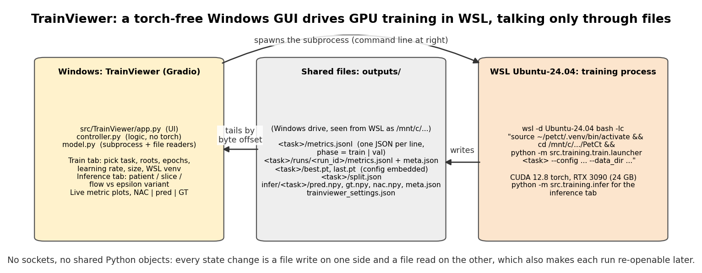

*Figure 7. The web tool (Windows, no PyTorch) and the training process (WSL, PyTorch) never share memory. They communicate only through files under `outputs/`, which WSL sees under `/mnt/c/…`.*

The web tool (`src/TrainViewer/`) runs on Windows in a Python environment without PyTorch, so it can never import the training code. It starts a training or inference run with a `subprocess` call of the form

```
wsl -d Ubuntu-24.04 bash -lc "source ~/petct/.venv/bin/activate && cd /mnt/c/<repo> && python -m src.training.train.launcher <stage> <flags>"
```

and then only reads files. `MetricsReader` tails `metrics.jsonl` by byte offset so that a long log is not re-parsed on every refresh; `CheckpointIndex` lists the `best.pt`/`last.pt` files and reads the embedded configuration to show the prediction type; `InferenceRunner` launches `src.training.infer` and displays the NAC, prediction and ground-truth triplet with the 14 metrics; `WslRunner` wraps the subprocess. Settings (WSL distribution, virtual environment path, data roots, cache folder) persist in `outputs/trainviewer_settings.json`. The Train tab lists the roots in a one-column editor and shows the patient count computed by the torch-free `dataset_index.py`. `controller.py` holds every decision the UI makes, so it is tested without Gradio (`test_trainviewer_controller.py`, `test_trainviewer_model.py`).

### 7.4 The desktop viewer

`src/DataViewer/` is a Tkinter application in the model–view–presenter pattern (the model loads data, the view draws, the presenter connects them and holds no widget code). It loads a patient's CT, AC PET and NAC PET series, converts CT to Hounsfield units (the standard density scale of CT) and PET to SUV using the patient weight and injected dose from the DICOM header, shows axial, coronal and sagittal cuts (coronal and sagittal are flipped with `np.flipud` at extraction, and any overlay must apply the same flip), overlays segmentations, and draws the prostate "zone of interest" box. The box is defined in millimetres (`bbox_mm`) and mapped to each volume's voxel grid through `VolumeGeometry`, because the PET and CT grids differ. The prostate locator (`src/utils/prostate_locator.py`) that proposes the box was the deliverable of the first phase of the project and is documented in `.github/agents/core-summary.md` and `viewer-summary.md`.

### 7.5 Tests

`pytest src/tests/` runs on the CPU in a few minutes. Groups:

| Files | What they pin down |
| --- | --- |
| `test_flow_bridge.py`, `test_ft3d_flow.py`, `test_latent_scale.py` | The leak identity, the step-invariance claim, the U-shaped sampler's symmetry, latent scale forced to 1 in flow mode, the flow YAML sanity (control arm keeps perceptual weight 0) |
| `test_inflation.py`, `test_inflation_freeze.py`, `test_ae3d_extra_levels.py` | The 2D→3D copy is exact per slice, the plan lists every key, the centre-freeze masks the right gradients, the extra-level autoencoder shapes |
| `test_quant_losses.py`, `test_perceptual.py`, `test_lpl_perceptual.py` | Weight maps have mean 1 and the right floors, the expectile and slope penalty minimisers, perceptual losses see brightness |
| `test_image_metrics.py`, `test_patient_split.py`, `test_precache.py`, `test_prefetch_cache.py`, `test_dataset_index.py` | The 14 metrics on constructed cases, by-patient splits are disjoint, cache round-trips and staleness, prefetch thread safety, multi-root patient indexing |
| `test_training_models.py`, `test_training_steps.py`, `test_train_scripts_cpu.py`, `test_training_launcher_smoke.py`, `test_smoke_*.py`, `test_resume_training.py`, `test_scheduling.py`, `test_metrics_writer.py` | Every stage builds, takes a step, saves, resumes bit-exactly; the learning-rate schedule and EMA |
| `test_augment.py`, `test_volume_augmentation.py` | The same random geometry is applied to NAC and AC |
| `test_trainviewer_controller.py`, `test_trainviewer_model.py`, `test_segmentation.py` | The web tool's logic without a browser; the segmentation helpers |

### 7.6 Known bugs, stale parts and traps

1. **The root `README.md` is stale.** It describes an organ-conditioned Swin-UNETR segmentation design with files (`src/config.py`, `src/dataset.py`, `src/model.py`) that do not exist. `CLAUDE.md` and this report are the ground truth.
2. **Inert YAML loss weights.** The `loss:` block in the autoencoder configs (`recon_l1_weight`, `kl_weight`) and in the flow configs (`noise_mse_weight`, `recon_l1_weight`) is not read; the weights are hard-coded (Section 5.2).
3. **Unused `eta` in DDIM.** `ddim_sample` accepts an `eta` argument for stochastic sampling but ignores it; the sampler is always deterministic.
4. **Dead module.** `src/training/utils/amp.py` is not imported anywhere (mixed precision is handled inline).
5. **Duplicate handlers** in `src/DataViewer/view.py` (two near-identical event handlers survive a refactor).
6. **Sub-folder READMEs drift** (`src/training/README.md`, `src/TrainViewer/README.md`, `src/DataViewer/README.md` predate the flow branch in places).
7. **Hard-coded paths** in every `scripts/_*.sh` driver (`/mnt/d/DeepTrainingData/Project/…`, `/mnt/c/DeepTrainingData/PetCT`, the venv). Edit before use elsewhere.
8. **Deprecation warnings** from MONAI's generative package import path and from PyTorch's autocast API.
9. **Evaluation folder collision.** `scripts/_flow_diff2d2.sh` writes its evaluation to `outputs/eval/diff2d_flow_nc/` (a name left over from an earlier arm); the run itself is `diff2d_flow2`.
10. **An empty test stub**, `test_predictor_initialization`, passes without asserting anything.
11. **Splits are not reproducible from the seed alone** (Section 4.7); always pass `--split_json`.
12. **The maximum-intensity metric is meaningless** because of the 99th-percentile clipping (Section 4.5); it is still computed and still appears in old evaluation files.
13. **Spacing and origin are placeholders** in the cache; nothing downstream may treat them as physical.
14. **No SUV calibration and no registration** anywhere in the training pipeline (Sections 4.5, 4.6).
15. **Fixed.** The silent fallback when the YAML library was missing (Section 6.4) now raises.

### 7.7 Maintainer notes

- The number in any figure or table of this report can be traced: `scripts/make_report_figures.py` prints, for every figure, the values it read and the files it read them from.
- Never compare two arms on different test sets; if a run predates `--split_json`, use the intersection (`scripts/_cmp_eval_paired.py`, `outputs/eval/_clean24_split.json`).
- A fine-tune arm that shows nothing after 1,500 steps is not evidence of anything (Section 6.9). Use 6,000 steps at 5·10⁻⁵, a matched control, and a fresh folder (`scripts/_ft_iwlat.sh` is the template).
- Check step invariance (8 versus 32 steps) on any new flow checkpoint; a difference above 0.3 dB means the run is not what its label says.
- The 3D self-attention in the autoencoder is the one option that can exhaust the 24 GB card; it is off and should stay off at 64³ and above unless the batch is reduced.

---

## 8. How to replicate every result

### 8.1 Environment

Training runs under Windows Subsystem for Linux, Ubuntu 24.04, with a Python virtual environment at `~/petct/.venv`:

```
python3 -m venv ~/petct/.venv && source ~/petct/.venv/bin/activate
pip install -r requirements.txt        # PyTorch 2.11 (CUDA 12.8 build), MONAI, MONAI-generative, nibabel, pydicom, SimpleITK, numpy
```

The two graphical tools and the figure script run on Windows Python 3.12 with matplotlib; they do not need PyTorch. The repository is expected at a path visible to both systems (here `c:\Users\algo\VScodeProjects\PetCt\PetCt`, that is `/mnt/c/Users/algo/VScodeProjects/PetCt/PetCt` in WSL). Every command below is run from the repository root inside the activated WSL environment unless stated.

### 8.2 Data

1. Download the TCIA collections (`scripts/download_tcia_series.py`) and place the ten roots under one folder, here `/mnt/d/DeepTrainingData/Project/`.
2. Audit which series are NAC and which are AC: `python scripts/inspect_pet_nac.py --data_dir <roots>`.
3. Build the cache once:

```
python -m src.training.precache --data_dir <root1> <root2> … --cache_dir /mnt/c/DeepTrainingData/PetCT --dtype float16 --workers 2
```

(`--force` rebuilds; the cache is validated against the source folders' modification times on every read.)

### 8.3 The delivered chain, stage by stage

The driver scripts below are the exact commands that produced the delivered checkpoints; they are reproduced verbatim (comments stripped) so this report is self-contained. Adjust the hard-coded paths (Section 7.6, item 7).

**`scripts/_ae2d_p_retrain.sh`**

```bash
set -u
cd /mnt/c/Users/algo/VScodeProjects/PetCt/PetCt
PY=~/petct/.venv/bin/python
CACHE=/mnt/c/DeepTrainingData/PetCT
SAVE=outputs/ae2d_p
ROOTS=(
  "/mnt/d/DeepTrainingData/Project/ACRIN 6668"
  "/mnt/d/DeepTrainingData/Project/PetCt/Bladder 13.11.25"
  "/mnt/d/DeepTrainingData/Project/PetCtNormal/PET_CT_NORMAL_2"
  "/mnt/d/DeepTrainingData/Project/NSCLC_Radiogenomics"
  "/mnt/d/DeepTrainingData/Project/TCGA-LUAD"
  "/mnt/d/DeepTrainingData/Project/CPTAC-LUAD"
  "/mnt/d/DeepTrainingData/Project/CPTAC-LSCC"
  "/mnt/d/DeepTrainingData/Project/CPTAC-UCEC"
  "/mnt/d/DeepTrainingData/Project/CPTAC-PDA"
  "/mnt/d/DeepTrainingData/Project/TCGA-THCA"
)
mkdir -p "$SAVE"
echo ">>> STAGE_START ae2d_p_train $(date '+%H:%M:%S')"
"$PY" -m src.training.train.train_ae2d \
  --config src/training/configs/ae2d.yaml \
  --data_dir "${ROOTS[@]}" --cache_dir "$CACHE" --prefetch 2 --loader_workers 8 --patient_reuse 32 \
  --epochs 200 --steps_per_epoch 500 --val_every 2500 --val_batches 8 \
  --val_fraction 0.2 --test_fraction 0.1 \
  --batch_size 16 --slice_size 128 --modality pet \
  --device cuda --save_dir "$SAVE" \
  > "$SAVE/train.log" 2>&1
rc=$?; echo ">>> STAGE_END ae2d_p_train rc=$rc $(date '+%H:%M:%S')"
if [ $rc -ne 0 ]; then echo ">>> ABORT"; exit $rc; fi
echo ">>> COMPARE vs outputs/ae2d $(date '+%H:%M:%S')"
"$PY" scripts/_ae_p_compare.py
echo ">>> DONE $(date '+%H:%M:%S')"
```

**`scripts/_ae3d_p_retrain.sh`**

```bash
set -u
cd /mnt/c/Users/algo/VScodeProjects/PetCt/PetCt
PY=~/petct/.venv/bin/python
CACHE=/mnt/c/DeepTrainingData/PetCT
SAVE=outputs/ae3d_p
ROOTS=(
  "/mnt/d/DeepTrainingData/Project/ACRIN 6668"
  "/mnt/d/DeepTrainingData/Project/PetCt/Bladder 13.11.25"
  "/mnt/d/DeepTrainingData/Project/PetCtNormal/PET_CT_NORMAL_2"
  "/mnt/d/DeepTrainingData/Project/NSCLC_Radiogenomics"
  "/mnt/d/DeepTrainingData/Project/TCGA-LUAD"
  "/mnt/d/DeepTrainingData/Project/CPTAC-LUAD"
  "/mnt/d/DeepTrainingData/Project/CPTAC-LSCC"
  "/mnt/d/DeepTrainingData/Project/CPTAC-UCEC"
  "/mnt/d/DeepTrainingData/Project/CPTAC-PDA"
  "/mnt/d/DeepTrainingData/Project/TCGA-THCA"
)
mkdir -p "$SAVE"
echo ">>> STAGE_START ae3d_p_train $(date '+%H:%M:%S')"
"$PY" -m src.training.train.train_ae3d \
  --config src/training/configs/ae3d.yaml \
  --data_dir "${ROOTS[@]}" --cache_dir "$CACHE" --prefetch 2 \
  --epochs 100 --steps_per_epoch 500 --val_every 2500 --val_batches 4 \
  --val_fraction 0.2 --test_fraction 0.1 \
  --batch_size 1 --crop_size 64 \
  --ae2d_ckpt outputs/ae2d_p/best.pt \
  --device cuda --save_dir "$SAVE" \
  > "$SAVE/train.log" 2>&1
rc=$?; echo ">>> STAGE_END ae3d_p_train rc=$rc $(date '+%H:%M:%S')"
if [ $rc -ne 0 ]; then echo ">>> ABORT"; exit $rc; fi
echo ">>> COMPARE vs outputs/ae3d $(date '+%H:%M:%S')"
"$PY" scripts/_ae_p_compare.py --old outputs/ae3d/metrics.jsonl --new outputs/ae3d_p/metrics.jsonl --tag ae3d
echo ">>> DONE $(date '+%H:%M:%S')"
```

**`scripts/_flow_perc_diff2d_p.sh`**

```bash
set -u
cd /mnt/c/Users/algo/VScodeProjects/PetCt/PetCt
PY=~/petct/.venv/bin/python
CACHE=/mnt/c/DeepTrainingData/PetCT
SAVE=outputs/diff2d_flow_perc_p
ROOTS=("/mnt/d/DeepTrainingData/Project/ACRIN 6668" "/mnt/d/DeepTrainingData/Project/CPTAC-LSCC" "/mnt/d/DeepTrainingData/Project/CPTAC-LUAD" "/mnt/d/DeepTrainingData/Project/CPTAC-PDA" "/mnt/d/DeepTrainingData/Project/CPTAC-UCEC" "/mnt/d/DeepTrainingData/Project/NSCLC_Radiogenomics" "/mnt/d/DeepTrainingData/Project/PetCt/Bladder 13.11.25" "/mnt/d/DeepTrainingData/Project/PetCtNormal/PET_CT_NORMAL_2" "/mnt/d/DeepTrainingData/Project/TCGA-LUAD" "/mnt/d/DeepTrainingData/Project/TCGA-THCA")
echo ">>> STAGE_START flow_perc_train $(date '+%H:%M:%S')"
"$PY" -m src.training.train.launcher diff2d \
  --config src/training/configs/diff2d_flow_perc.yaml \
  --data_dir "${ROOTS[@]}" --cache_dir "$CACHE" --device cuda \
  --val_fraction 0.2 --test_fraction 0.1 \
  --epochs 100 --steps_per_epoch 1000 --val_every 2500 --val_batches 8 \
  --latent_size 128 --ae_ckpt outputs/ae2d_p/best.pt --save_dir "$SAVE" \
  --cache_size 200 --prefetch 2 \
  > outputs/diff2d_flow_perc_p.log 2>&1
rc=$?; echo ">>> STAGE_END flow_perc_train rc=$rc $(date '+%H:%M:%S')"
if [ $rc -ne 0 ]; then echo ">>> ABORT train"; exit $rc; fi
for S in 8 16 32; do
  echo ">>> STAGE_START eval_s$S $(date '+%H:%M:%S')"
  "$PY" -m src.training.evaluate --task diff2d \
    --data_dir "${ROOTS[@]}" --mode test \
    --val_fraction 0.2 --test_fraction 0.1 --seed 42 \
    --diff_ckpt "$SAVE/best.pt" --ae_ckpt outputs/ae2d_p/best.pt --split_json "$SAVE/split.json" \
    --size 128 --num_slices 32 --ddim_steps $S --spacing linear \
    --guidance_scale 1.0 --max_patients 0 --device cuda \
    --out outputs/eval/diff2d_flow_perc_p/test_s$S.json > outputs/eval_flow_perc_p_s$S.log 2>&1
  echo ">>> STAGE_END eval_s$S rc=$? $(date '+%H:%M:%S')"
done
echo ">>> PIPELINE_DONE $(date '+%H:%M:%S')"
```

**`scripts/_flow_ft3d_p.sh`**

```bash
set -u
cd /mnt/c/Users/algo/VScodeProjects/PetCt/PetCt
PY=~/petct/.venv/bin/python
CACHE=/mnt/c/DeepTrainingData/PetCT
ROOTS=(
  "/mnt/d/DeepTrainingData/Project/ACRIN 6668"
  "/mnt/d/DeepTrainingData/Project/PetCt/Bladder 13.11.25"
  "/mnt/d/DeepTrainingData/Project/PetCtNormal/PET_CT_NORMAL_2"
  "/mnt/d/DeepTrainingData/Project/NSCLC_Radiogenomics"
  "/mnt/d/DeepTrainingData/Project/TCGA-LUAD"
  "/mnt/d/DeepTrainingData/Project/CPTAC-LUAD"
  "/mnt/d/DeepTrainingData/Project/CPTAC-LSCC"
  "/mnt/d/DeepTrainingData/Project/CPTAC-UCEC"
  "/mnt/d/DeepTrainingData/Project/CPTAC-PDA"
  "/mnt/d/DeepTrainingData/Project/TCGA-THCA"
)
for f in outputs/ae2d_p/best.pt outputs/diff2d_flow_perc_p/best.pt; do
  if [ ! -f "$f" ]; then echo ">>> MISSING $f -- abort"; exit 2; fi
done
SAVE1=outputs/ae3d_p
mkdir -p "$SAVE1"
echo ">>> STAGE_START ae3d_p_train $(date '+%Y-%m-%d %H:%M:%S')"
"$PY" -m src.training.train.train_ae3d \
  --config src/training/configs/ae3d.yaml \
  --data_dir "${ROOTS[@]}" --cache_dir "$CACHE" --prefetch 2 \
  --epochs 100 --steps_per_epoch 500 --val_every 2500 --val_batches 4 \
  --val_fraction 0.2 --test_fraction 0.1 \
  --batch_size 1 --crop_size 64 \
  --ae2d_ckpt outputs/ae2d_p/best.pt \
  --device cuda --save_dir "$SAVE1" \
  > "$SAVE1/train.log" 2>&1
rc=$?; echo ">>> STAGE_END ae3d_p_train rc=$rc $(date '+%Y-%m-%d %H:%M:%S')"
if [ $rc -ne 0 ]; then echo ">>> ABORT after ae3d_p"; exit $rc; fi
"$PY" scripts/_ae_p_compare.py --old outputs/ae3d/metrics.jsonl --new "$SAVE1/metrics.jsonl" --tag ae3d || true
SAVE2=outputs/ft3d_flow_p
mkdir -p "$SAVE2"
echo ">>> STAGE_START ft3d_flow_p_train $(date '+%Y-%m-%d %H:%M:%S')"
"$PY" -m src.training.train.launcher ft3d \
  --config src/training/configs/ft3d_flow.yaml \
  --data_dir "${ROOTS[@]}" --cache_dir "$CACHE" --device cuda \
  --val_fraction 0.2 --test_fraction 0.1 \
  --epochs 30 --steps_per_epoch 1000 --val_every 2500 --val_batches 4 \
  --latent_size 64 --ae_ckpt "$SAVE1/best.pt" \
  --inflate_from outputs/diff2d_flow_perc_p/best.pt --save_dir "$SAVE2" \
  --cache_size 128 \
  > outputs/ft3d_flow_p.log 2>&1
rc=$?; echo ">>> STAGE_END ft3d_flow_p_train rc=$rc $(date '+%Y-%m-%d %H:%M:%S')"
if [ $rc -ne 0 ]; then echo ">>> ABORT after ft3d train"; exit $rc; fi
for S in 16 32; do
  echo ">>> STAGE_START eval_s$S $(date '+%Y-%m-%d %H:%M:%S')"
  "$PY" -m src.training.evaluate --task ft3d \
    --data_dir "${ROOTS[@]}" --mode test \
    --val_fraction 0.2 --test_fraction 0.1 --seed 42 \
    --diff_ckpt "$SAVE2/best.pt" --ae_ckpt "$SAVE1/best.pt" --split_json "$SAVE2/split.json" \
    --size 64 --ddim_steps $S --spacing linear --guidance_scale 1.0 --max_patients 0 --device cuda \
    --out outputs/eval/ft3d_flow_p/test_s$S.json > outputs/eval_ft3d_flow_p_s$S.log 2>&1
  echo ">>> STAGE_END eval_s$S rc=$? $(date '+%Y-%m-%d %H:%M:%S')"
done
echo ">>> PIPELINE_DONE $(date '+%Y-%m-%d %H:%M:%S')"
```

**`scripts/_ft_iwlat.sh`**

```bash
set -u
cd /mnt/c/Users/algo/VScodeProjects/PetCt/PetCt
PY=/root/petct/.venv/bin/python
CACHE=/mnt/c/DeepTrainingData/PetCT
SPLIT=${SPLIT:-outputs/ft3d_flow_p/split.json}
LR=${LR:-5e-5}
ROOTS=(
  "/mnt/d/DeepTrainingData/Project/ACRIN 6668"
  "/mnt/d/DeepTrainingData/Project/PetCt/Bladder 13.11.25"
  "/mnt/d/DeepTrainingData/Project/PetCtNormal/PET_CT_NORMAL_2"
  "/mnt/d/DeepTrainingData/Project/NSCLC_Radiogenomics"
  "/mnt/d/DeepTrainingData/Project/TCGA-LUAD"
  "/mnt/d/DeepTrainingData/Project/CPTAC-LUAD"
  "/mnt/d/DeepTrainingData/Project/CPTAC-LSCC"
  "/mnt/d/DeepTrainingData/Project/CPTAC-UCEC"
  "/mnt/d/DeepTrainingData/Project/CPTAC-PDA"
  "/mnt/d/DeepTrainingData/Project/TCGA-THCA"
)
[ -e "$SPLIT" ] || { echo "MISSING prerequisite: $SPLIT" >&2; exit 1; }
arm_cfg() {
  case "$1" in
    iwlat)    CFG=src/training/configs/ft3d_ft_iwlat.yaml;    SAVE=outputs/ft3d_ft_iwlat
              INIT=outputs/ft3d_flow_p/best.pt; AE=outputs/ae3d_p/best.pt
              SIZE=64;  DEF_STEPS=6000; CSIZE=32 ;;
    ctl)      CFG=src/training/configs/ft3d_ft_control.yaml;  SAVE=outputs/ft3d_ft_ctl5e5
              INIT=outputs/ft3d_flow_p/best.pt; AE=outputs/ae3d_p/best.pt
              SIZE=64;  DEF_STEPS=6000; CSIZE=32 ;;
    2x_iwlat) CFG=src/training/configs/ft3d_2x_ft_iwlat.yaml; SAVE=outputs/ft3d_2x_ft_iwlat
              INIT=outputs/ft3d_2x/best.pt;     AE=outputs/ae3d_2x2/best.pt
              SIZE=128; DEF_STEPS=4000; CSIZE=24 ;;
    2x_ctl)   CFG=src/training/configs/ft3d_2x.yaml;          SAVE=outputs/ft3d_2x_ft_ctl5e5
              INIT=outputs/ft3d_2x/best.pt;     AE=outputs/ae3d_2x2/best.pt
              SIZE=128; DEF_STEPS=4000; CSIZE=24 ;;
    *) echo "unknown arm: $1 (iwlat|ctl|2x_iwlat|2x_ctl)" >&2; exit 1 ;;
  esac
}
ARMS=("$@")
[ ${#ARMS[@]} -eq 0 ] && ARMS=(iwlat ctl)
NORESUME=${NORESUME:-0}
for ARM in "${ARMS[@]}"; do
  arm_cfg "$ARM"
  N=${STEPS:-$DEF_STEPS}
  for f in "$CFG" "$INIT" "$AE"; do
    [ -e "$f" ] || { echo "MISSING prerequisite: $f" >&2; exit 1; }
  done
  RESUME=()
  if [ "$NORESUME" != "1" ] && [ -f "$SAVE/last.pt" ]; then
    RESUME=(--resume)
    echo "RESUMING ${ARM} from ${SAVE}/last.pt"
  fi
  echo "================= ARM ${ARM}: ${N} steps @ lr ${LR}, ${SIZE}^3, init ${INIT}  $(date +%H:%M)"
  mkdir -p "$SAVE"
  "$PY" -m src.training.train.train_ft3d \
    --config "$CFG" --save_dir "$SAVE" \
    --data_dir "${ROOTS[@]}" --cache_dir "$CACHE" --prefetch 6 --cache_size "$CSIZE" \
    --ae_ckpt "$AE" --init_from "$INIT" --split_json "$SPLIT" "${RESUME[@]+"${RESUME[@]}"}" \
    --learning_rate "$LR" \
    --epochs $(( (N + 499) / 500 )) --steps_per_epoch 500 \
    --val_every 500 --val_batches 4 --latent_size "$SIZE" \
    --device cuda 2>&1 | tail -12
  "$PY" -m src.training.evaluate --task ft3d \
    --data_dir "${ROOTS[@]}" \
    --ae_ckpt "$AE" --diff_ckpt "$SAVE/best.pt" \
    --split_json "$SPLIT" --mode test \
    --size "$SIZE" --ddim_steps 16 --spacing linear --max_patients 0 --device cuda \
    --clamp_output --out "outputs/eval/$(basename "$SAVE")/test_s16.json" 2>&1 | tail -2
done
echo "================= iwlat runs done  $(date +%H:%M)"
```

**`scripts/_report_triplets_ft3d.sh`**

```bash
set -u
cd /mnt/c/Users/algo/VScodeProjects/PetCt/PetCt
PY=~/petct/.venv/bin/python
ROOTS=(
  "/mnt/d/DeepTrainingData/Project/ACRIN 6668"
  "/mnt/d/DeepTrainingData/Project/PetCt/Bladder 13.11.25"
  "/mnt/d/DeepTrainingData/Project/PetCtNormal/PET_CT_NORMAL_2"
  "/mnt/d/DeepTrainingData/Project/NSCLC_Radiogenomics"
  "/mnt/d/DeepTrainingData/Project/TCGA-LUAD"
  "/mnt/d/DeepTrainingData/Project/CPTAC-LUAD"
  "/mnt/d/DeepTrainingData/Project/CPTAC-LSCC"
  "/mnt/d/DeepTrainingData/Project/CPTAC-UCEC"
  "/mnt/d/DeepTrainingData/Project/CPTAC-PDA"
  "/mnt/d/DeepTrainingData/Project/TCGA-THCA"
)
"$PY" scripts/report_triplets.py --task ft3d \
  --data_dir "${ROOTS[@]}" \
  --diff_ckpt outputs/ft3d_flow_p/best.pt \
  --ae_ckpt outputs/ae3d_p/best.pt \
  --split_json outputs/ft3d_flow_p/split.json \
  --mode test --val_fraction 0.2 --test_fraction 0.1 --seed 42 \
  --size 64 --ddim_steps 16 --spacing linear --max_patients 0 \
  --device cuda \
  --n_axial 64 --n_coronal 64 --n_sagittal 64 \
  --out_dir outputs/report/ft3d_flow_p \
  --label "ft3d_flow_p — 3D rectified-flow bridge" \
  "$@"
```


Order and dependencies: `_ae2d_p_retrain.sh` → `_ae3d_p_retrain.sh` (or stage 1 of `_flow_ft3d_p.sh`) → `_flow_perc_diff2d_p.sh` → `_flow_ft3d_p.sh` (stage 2) → optionally `_ft_iwlat.sh iwlat` and `_ft_iwlat.sh ctl` for the two fine-tune arms. Wall-clock on one RTX 3090: roughly one day for the 2D autoencoder, one day for the 3D autoencoder, one day for the 2D flow model, one day for the 3D flow model; each fine-tune arm a few hours.

Other arms: `scripts/_chain_2x.sh` (128³ chain), `scripts/_ft_ablation.sh` (the twelve-arm ablation), `scripts/_cfg_diff2d.sh` and `_cfg_sweep_*.sh` (epsilon with guidance), `scripts/_flow_diff2d2.sh` (first true 2D flow run).

### 8.4 Evaluation, inference and the figures

```
# whole test split of a run (3D, 16 Euler steps, linear spacing, clamped)
python -m src.training.evaluate --task ft3d --ckpt outputs/ft3d_flow_p/best.pt --ae_ckpt outputs/ae3d_p/best.pt \
    --data_dir <roots> --cache_dir /mnt/c/DeepTrainingData/PetCT --split_json outputs/ft3d_flow_p/split.json \
    --mode test --size 64 --ddim_steps 16 --spacing linear --max_patients 0 --out outputs/eval/ft3d_flow_p/test_s16.json

# one patient (writes outputs/infer/ft3d/{pred.npy,gt.npy,meta.json})
python -m src.training.infer --task ft3d --data_dir <roots> --cache_dir /mnt/c/DeepTrainingData/PetCT \
    --patient_index 3 --ddim_steps 16 --spacing linear --out outputs/infer/ft3d

# the qualitative triplets of Figure 16
bash scripts/_report_triplets_ft3d.sh

# every figure of this report, from the raw JSON files (Windows or WSL, needs matplotlib only)
python scripts/make_report_figures.py

# the tests
pytest src/tests/
```

The exact flag list of `evaluate.py` is in the driver scripts' `eval` blocks (Section 8.3), which are the authoritative form.

### 8.5 The graphical tools

```
python src/TrainViewer/main.py     # Windows; set the WSL distribution and venv path in the Train tab
python src/DataViewer/main.py      # Windows; opens a patient folder
```

---

## 9. Limitations, open problems and possible extensions

**Limitations of what was delivered.**

1. **No SUV.** Predictions are in per-volume relative units (Section 4.5). A clinical use needs the absolute scale back. The cheapest fix is to normalise with a *global* scale instead of per-volume percentiles and store the two percentiles alongside each prediction; this changes the data pipeline and needs a retrain.
2. **64³ resolution.** The grid alone costs 6 percent in the hot band and hides small lesions (Section 6.6). The 128³ chain exists and is under-trained (Section 6.7).
3. **Under-dispersion.** The best model under-estimates the hot band by 10 percent, of which about 3 points are the autoencoder and about 6 are the grid; the rest is the flow model. Section 5.3.6 shows what part of it is fixable without new information.
4. **Cohort.** Most paired scans are lung-cancer patients from one trial. A model trained mostly on lungs may correct lungs better than the abdomen (the "lung bias" risk noted in the literature review). There is no external validation on another scanner or vendor.
5. **Deterministic output.** The bridge gives one answer per input and no uncertainty. A hallucinated hot spot would look as confident as a real one.
6. **No clinical validation.** The metrics are image metrics on a normalised scale; there is no reader study and no organ-level SUV bias table, which is the decisive metric in the field (Section 10).

**Extensions, in the order the author would attempt them.**

1. **A plain regression control.** Section 5.3.5 predicts that a UNet trained directly with L1 from the NAC code to the AC code should land close to the one-step flow. It costs one training run and would settle how much the multi-step bridge is worth. It is the most important missing experiment.
2. **Expectile or quantile target** (`quant: expectile`, Section 5.6.4) at the corrected fine-tune budget, to move the target off the mean in the hot band. The theorem says this is the only way to raise the slope without new information; the recalibration experiment shows the price it must pay in squared error, so the judge should be the hot band, not PSNR.
3. **Finish the 128³ chain**, or decode the 64³ latent at 128³ with a higher-resolution decoder (the encoder keeps the cheap grid, the decoder recovers detail).
4. **Organ-level evaluation.** The segmentation tooling from the first phase (`src/utils/segmentors.py`) can produce liver, lung, heart and bladder masks; report the mean relative error per organ, which is what the published work reports.
5. **A true-3D perceptual backbone** (for example MedicalNet's 3D ResNet) in place of the slice-wise VGG, planned as a drop-in `med3d` backend in `perceptual.py`.
6. **A stochastic bridge** (Schrödinger-bridge style, I²SB) to obtain several plausible outputs per input and thus an uncertainty map.
7. **Centre-freeze warm-start** for the 3D stage (Section 5.5), which is implemented and tested but not yet measured against the plain inflation.

---

## 10. Position against the published literature

The literature review (`docs/nac_ac_benchmark.md`, last re-verified in June 2026) found no public benchmark for CT-free PET attenuation correction: every published result is on an in-house cohort with its own scanner, tracer protocol, resolution and metric set, so numbers across papers are not comparable and there is no leaderboard to place this project on. The relevant lines of work are:

- Direct convolutional networks from NAC to AC in image space (Shiri et al., Radiology: Artificial Intelligence 2021 [1]; Dong et al., Physics in Medicine and Biology 2020 [4]), and generative-adversarial variants (Li et al., European Radiology 2024 [3]). These report organ-level SUV errors of a few percent and lesion-level errors under about 10 percent at native resolution, with SUV-calibrated inputs.
- Networks that predict the *attenuation map* or a *pseudo-CT* from the NAC and then run the standard reconstruction (Guo et al., Nature Communications 2022 [5]).
- Diffusion-based approaches (MADM, arXiv 2406.08374 [2]; the conditional diffusion model of Hu et al., Journal of Nuclear Medicine 2023 [6]). Several of these report that a plain 3D diffusion model underperforms the convolutional baselines and needs extra machinery to reach parity, which agrees with the collapse observed here (Section 6.4).

What this project adds relative to those: a fully public pipeline (data from TCIA, code and every number reproducible), a bridge formulation that removes the conditioning problem of diffusion by construction, the analytical account of under-dispersion (Section 5.3.6) with a matching measurement, and a measured decomposition of the remaining error into grid, autoencoder and generative parts. What it lacks relative to them: SUV units, native resolution, organ-level evaluation, and an external cohort.

---

## 11. References

1. Shiri I. et al., "Deep-learning-based attenuation correction of PET images without CT", Radiology: Artificial Intelligence 3(3), 2021. doi:10.1148/ryai.2020200137.
2. "MADM: Mask-aware diffusion model for CT-free PET attenuation correction", arXiv:2406.08374, 2024.
3. Li Y. et al., "Deep learning-based attenuation correction for whole-body PET", European Radiology 34, 2024. doi:10.1007/s00330-024-10647-1.
4. Dong X. et al., "Deep learning-based attenuation correction in the absence of structural information for whole-body PET imaging", Physics in Medicine and Biology 65, 2020. PMC7099429.
5. Guo R. et al., "Using domain knowledge for robust and generalizable deep learning-based CT-free PET attenuation and scatter correction", Nature Communications 13, 2022. doi:10.1038/s41467-022-33562-9.
6. Hu Y. et al., conditional denoising diffusion for CT-free attenuation correction, Journal of Nuclear Medicine 64 (supplement), 2023.
7. ACRIN 6668 / RTOG 0235 FDG-PET/CT collection, The Cancer Imaging Archive (TCIA).
8. Liu X., Gong C., Liu Q., "Flow straight and fast: learning to generate and transfer data with rectified flow", ICLR 2023 (arXiv:2209.03003).
9. Lee S. et al., "Improving the training of rectified flows", NeurIPS 2024 (arXiv:2405.20320). The (1 − τ) weighting and U-shaped timestep density.
10. Berrada T. et al., "Boosting latent diffusion with perceptual objectives", arXiv:2411.04873, 2024. The latent perceptual loss.
11. Liu G.-H. et al., "I²SB: Image-to-image Schrödinger bridge", ICML 2023.
12. Song J., Meng C., Ermon S., "Denoising diffusion implicit models", ICLR 2021 (DDIM).
13. Ho J., Salimans T., "Classifier-free diffusion guidance", 2022.
14. Karras T. et al., "Elucidating the design space of diffusion-based generative models", NeurIPS 2022 (the step spacing).
15. Rombach R. et al., "High-resolution image synthesis with latent diffusion models", CVPR 2022 (the latent-diffusion design and the tiny-KL autoencoder).
16. Cardoso M. J. et al., "MONAI: an open-source framework for deep learning in healthcare", 2022; and MONAI Generative Models.
17. Software references used during implementation: TorchCFM (conditional flow matching library) and the FAIR `flow_matching` library.

---

## Appendix A: glossary

| Term | Meaning |
| --- | --- |
| AC PET | Attenuation-corrected PET: the clinical image, corrected for photon loss in the body using a CT |
| Attenuation | Loss of photons by absorption or scattering on their way out of the body |
| Autoencoder (AE) | A network pair: an encoder that compresses a volume into a small code and a decoder that rebuilds it |
| Bland–Altman, limits of agreement (LoA) | Mean difference between two measurements and the interval that holds 95 percent of the differences |
| Bridge | A flow whose both ends are data (here NAC code and AC code) rather than data and noise |
| CFG | Classifier-free guidance: running a diffusion model with and without its condition and extrapolating between the two outputs |
| CT | Computed tomography: an X-ray scan of tissue density |
| DDIM | Denoising diffusion implicit models: a deterministic sampler for diffusion models |
| DICOM | The file format of medical scanners |
| Diffusion model | A generative model trained to remove noise, used by starting from noise and removing it step by step |
| EMA | Exponential moving average of the network weights during training; usually gives a smoother, better model |
| Epsilon prediction | A diffusion model that outputs the noise that was added |
| Euler method | The simplest way to follow a velocity field: move a small step in the current direction, repeat |
| FDG | Fluorodeoxyglucose, the sugar-based tracer used in most PET scans |
| Flow (rectified flow) | A model of a velocity field along straight lines between two distributions |
| Hot band | Voxels whose true value is between the 90th and 98th percentile of the volume; the project's proxy for lesion brightness |
| Hounsfield unit (HU) | The density scale of CT images |
| Inflation | Copying a trained 2D convolution into the centre slice of a 3D convolution |
| JSONL | One JSON object per line; the training log format |
| KL divergence | A measure of the difference between two probability distributions; here used to keep the code well-scaled |
| L1 loss | Mean absolute error |
| Latent | The compressed code produced by the autoencoder's encoder |
| LPL | Latent perceptual loss: perceptual comparison inside the frozen decoder |
| MAE | Mean absolute error |
| MONAI | Medical Open Network for AI: a PyTorch library for medical imaging |
| MSE | Mean squared error |
| NAC PET | Non-attenuation-corrected PET: the raw image |
| NRMSE | Root-mean-square error divided by the range of the truth |
| ODE | Ordinary differential equation |
| Percentile clip | Mapping the 1st and 99th percentile of a volume to 0 and 1 and clipping outside |
| PSNR | Peak signal-to-noise ratio, in decibels; 3 dB more means half the squared error |
| R² (coefficient of determination) | Fraction of the truth's variance the prediction explains |
| RFPP | The project's name for the recipe of Lee et al. 2024 (U-shaped τ and (1 − τ) weighting) |
| Slope (regression) | Slope of the least-squares line of prediction against truth; 1 is perfect scale |
| SSIM | Structural similarity index; 1 for identical images |
| SUV | Standardised uptake value: tracer concentration normalised by dose and body weight |
| TCIA | The Cancer Imaging Archive, a public repository of medical images |
| τ (tau) | Position along the bridge, 0 at the AC code and 1 at the NAC code |
| UNet | An encoder–decoder network with skip connections at every resolution |
| Under-dispersion | A prediction whose spread is smaller than the truth's, that is slope < 1 |
| VGG | A 2014 image-classification network whose features are used for perceptual losses |
| WSL | Windows Subsystem for Linux |
| YAML | The configuration file format |
| ZOI | Zone of interest: the prostate bounding box of the first project phase |

## Appendix B: raw result tables

**B.1 Validation endpoints of every training run** (metric: recon L1 for autoencoders, rollout L1 for flow runs, one-step x̂₀ L1 for epsilon runs).

| Run | Kind | Step | Validation metric | PSNR (dB) | SSIM |
| --- | --- | --- | --- | --- | --- |
| `ae2d` | 2D AE, before perceptual fix | 72,000 | 0.00700 | 34.78 | |
| `ae2d_p` | 2D AE | 65,000 | 0.003089 | 41.00 | 0.9931 |
| `ae2d_2x` | 2D AE, 16 channels | 22,500 | 0.00221 | 44.51 | |
| `ae3d` | 3D AE, before fix | 13,000 | 0.01493 | 28.42 | |
| `ae3d_p` | 3D AE | 50,000 | 0.007777 | 33.05 | 0.9787 |
| `ae3d_2x2` | 3D AE, 128³ | 25,000 | 0.00953 | 30.58 | |
| `diff2d` | 2D epsilon | 249,000 | 0.01281 | | |
| `diff2d_cfg` | 2D epsilon + guidance | 142,500 | 0.01435 | | |
| `ft3d` | 3D epsilon | 56,000 | 0.01561 | | |
| `diff2d_flow` | mislabelled epsilon (YAML fallback) | 75,000 | 0.01396 | | |
| `diff2d_flow2` | 2D flow, first true run | 80,000 | 0.01251 | | |
| `diff2d_flow_perc` | 2D flow + perceptual, old AE | 80,000 | 0.01236 | | |
| `diff2d_flow_perc_p` | 2D flow + perceptual, `_p` AE | 92,500 | 0.010716 | 28.49 | 0.9509 |
| `diff2d_2x_long` | 2D flow, 16 channels | 30,000 | 0.01154 | | |
| `ft3d_flow` | 3D flow, old AE | 20,000 | 0.02012 | | |
| `ft3d_flow_p` | 3D flow, `_p` AE | 30,000 | 0.013633 | 26.32 | 0.9493 |
| `ft3d_flow_lpl_rfpp` | 3D flow + perceptual recipe | 21,000 | 0.013514 | | |
| `ft3d_2x` | 3D flow, 128³ | 15,000 | 0.025581 | 22.06 | 0.8462 |
| `ft3d_ft_ctl5e5` | fine-tune control | 6,000 | 0.01190 | | |
| `ft3d_ft_iwlat` | fine-tune, intensity weight | 6,000 | 0.01192 | | |

**B.2 Model sizes.**

| Checkpoint | Parameters | File size |
| --- | --- | --- |
| `ae2d_p` | 12,315,553 | 147 MB |
| `ae3d_p` | 35,689,633 | 427 MB |
| `diff2d_flow_perc_p` | 11,122,504 | 176 MB |
| `ft3d_flow_p`, `ft3d_ft_iwlat` | 28,983,112 | 462 MB |
| `ae3d_2x2` | 144,049,153 | 1.72 GB |
| `ft3d_2x` | 29,010,768 | 462 MB |
| `diff2d` (epsilon) | 702,808 | |
| `ft3d` (epsilon) | 1,196,552 | |

**B.3 Step-count curves** (test PSNR in dB, and SSIM where recorded).

| Arm | 8 | 16 | 32 | 64 |
| --- | --- | --- | --- | --- |
| `diff2d_flow_perc_p` | 25.846 | 25.767 | 25.725 | |
| `diff2d_flow2` | 25.698 | 25.609 | 25.570 | |
| `ft3d_flow_p` (unclamped) | | 25.294 | 25.247 | |
| `ft3d_2x` | | 21.439 | 21.405 | |
| `diff2d_flow` (mislabelled epsilon), PSNR | 15.805 | 16.379 | 16.110 | 15.659 |
| `diff2d_flow` (mislabelled epsilon), SSIM | 0.1175 | 0.2418 | 0.3091 | 0.3055 |

**B.4 Guidance sweep**, `diff2d_cfg`, 19 patients: weights 1 / 1.5 / 2 / 3 → SSIM 0.1880 / 0.2093 / 0.2672 / 0.3622; PSNR 14.54 / 14.61 / 14.66 / 14.54 dB.

**B.5 Native-resolution truth**, 12 test patients: see the table in Section 6.6.

**B.6 Fine-tune ablation**, 12 arms: see the table in Section 6.9.

**B.7 Paired comparison** intensity weight versus control: see Section 6.10. Recalibration (24 patients): slope 0.843 → 0.945, PSNR 25.64 → 24.88 dB.

**B.8 Evaluation files.** `outputs/eval/<run>/test_s<steps>.json` for every arm listed in Section 6.11, plus `outputs/eval/_clean24_split.json` (the 24-patient clean intersection) and `outputs/eval/diff2d_cfg_early/` (the early guidance sweep).

## Appendix C: list of figures

| | File | Content |
| --- | --- | --- |
| 1 | `fig01_system_overview.png` | The three parts of the repository |
| 2 | `fig02_training_chain.png` | The four training stages |
| 3 | `fig03_autoencoder.png` | Autoencoder architecture |
| 4 | `fig04_unet_flow_vs_epsilon.png` | The UNet, flow input versus epsilon input |
| 5 | `fig05_flow_bridge.png` | The flow bridge: training and sampling |
| 6 | `fig06_inference_path.png` | Inference data path |
| 7 | `fig07_trainviewer_contract.png` | Web tool ⇄ training file contract |
| 8 | `fig08_training_curves.png` | Validation curves of the delivered chain |
| 9 | `fig09_results_families.png` | Test results by model family |
| 10 | `fig10_under_dispersion.png` | Slope, hot band and p95 error across 3D arms |
| 11 | `fig11_paired_iwlat_vs_control.png` | Per-patient paired differences |
| 12 | `fig12_gradient_share.png` | Gradient share by intensity band |
| 13 | `fig13_step_invariance.png` | PSNR against Euler steps |
| 14 | `fig14_headroom_ceilings.png` | Input, model and autoencoder ceiling per metric |
| 15 | `fig15_per_patient_spread.png` | Per-patient metrics against the input |
| 16 | `fig16_qualitative_triplets.png` | Input, prediction and truth for three patients |
| 17 | `fig17_resolution_loss.png` | Cost of the working grid against native-resolution truth |
| 18 | `fig18_cfg_sweep.png` | Guidance weight sweep of the epsilon model |
| 19 | `fig19_finetune_ablation_inert.png` | The inert fine-tune ablation |

All figures are produced by `scripts/make_report_figures.py` from the files under `outputs/`, except Figure 16, whose panels come from `scripts/report_triplets.py`.
